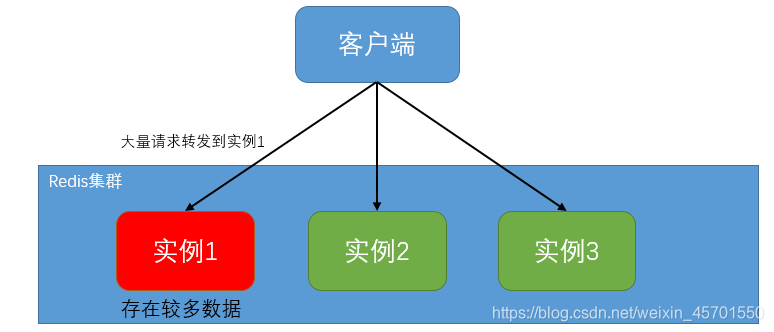
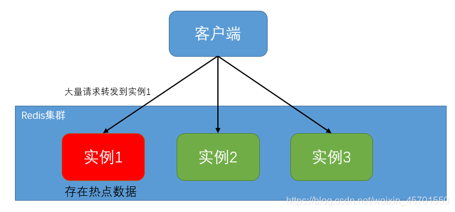

Redis设计问题

# Redis用哈希槽，而不是一致性哈希，为什么？

https://www.cnblogs.com/crazymakercircle/p/18018466

## Redis数据倾斜问题

一、什么是数据倾斜
   在redis集群模式下，数据会按照一定的分布规则分散到不同的实例上。如果由于业务数据特殊性，按照指定的分布规则，可能导致不同的实例上数据分布不均匀，如以下场景：有些切片实例上数据分布量较大，有些实例上数据分布量较少；有些实例上保存了热点数据，数据访问量较大，有些实例上保存数据相对较"冷"，几乎没有访问量。那么存储数据量大的实例，或者保存热点数据的实例，资源利用率会比较高，负载压力较大，导致其对数据请求响应变慢。此时就产生了数据倾斜。

二、有哪几种数据倾斜
通常来说，数据倾斜分为以下两种：数据量倾斜，数据访问倾斜。

三、数据量倾斜
数据量倾斜产生的根本原因是：数据在各个redis实例上分布不均匀。

产生数据分布不均匀的情况主要有以下三种。

1) 存在bigkey
当一个实例上存储了一个或者多个bigkey时，例如一个占用空间很大的string类型的数据，或者保存了一个包含很多数据元素的集合时，那么会导致该实例的内存资源消耗严重。而且对于bigkey的操作通常会造成实例IO线程阻塞，使该实例对数据请求处理效率严重下降。

对于bigkey造成的数据倾斜问题，一个根本的解决方案就是，避免bigkey的产生。常用的做法是对bigkey进行"化整为零",在业务层面生成数据的时候，尽量避免把过多的数据保存到同一个键中。具体可以参考 redis 使用规范。

2) HashTag使用不当
HashTag是使用redis的一个小技巧，使用方式是 在 key中添加一对花括号 {},这个 {} 可以将key的一部分内容包裹起来，而redis server会对于加上{}的key进行识别，并进行特殊处理。使用HashTag可以增强业务层面对redis集模式下，key分区的控制。具体来说：正常情况下，客户端根据key的完整内容，按照CRC16算法生成一个CRC16值，redis-server按照这个CRC16值，给这个key分配slot，而是用HashTag后，客户端计算key的CRC16值，不在是整个key的内容，而是{}括起来的那部分部分。使用HashTag，可以让我们根据业务属性，在key的适当位置添加{}，让业务相关的一些key存储到同一个slot中，同时也就分配到同一个实例上，当相关的数据全部分配到同一个实例上后，就可以执行实例内事务操作(目前redis 集群不支持跨实例事务操作)和范围查询等先关操作了。

虽然，HashTag，有利于实现跨实例的事务操作和范围查询，但是带来的风险就是，所有业务相关的的数据，都要放到同一个实例上，如果这个业务相关的数据量比较大的话，就会导致，业务所在实例的内存资源消耗严重。产生数据倾斜问题。如果使用 Hash Tag 进行切片的数据会带来较大的访问压力，就优先考虑避免数据倾斜，最好不要使用 Hash Tag 进行数据切片。因为事务和范围查询都还可以放在客户端来执行，而数据倾斜会导致实例不稳定，造成服务不可用

3)slot分配不均匀
在redis 集群中，slot是数据在多个redis实例间分配的的基本单元。在一个redis集群中，一共有16384个slot，这些slot会分配到集群中的实例上。如果slot在实例上分配不均匀的话，使某个或者某些实例上分配过多的slot，那么这些实例上被分配数据量也会更多一些，也就会产生类似HashTag一样的数据倾斜问题。

对于由于slot分配不均导致的数据倾斜问题，可以在slot分配前，通过人工分配的方式，来避免多个slot分配到同一个实例的问题，如果一个集群中slot已经分配完毕，可以通过redis提供的运维工具和相应的运维命令，来查看redis集群中，slot的分配情况，如果存在某些实例上slot分配过多的情况，那么可以将这些过多的slot转移到其他实例上。

四、数据访问倾斜

除了数据量过多导致的数据倾斜问题外，如果实例上存在热点数据，如电商秒杀场景中的商品信息。那么会导致所在实例数据请求访问量远高于其他实例，产生数据访问倾斜。

对于热点数据问题，通常采用的解决方案是多副本冗余。具体做法：我们把热点数据复制多份，在每一个数据副本的 key 中增加一个随机前缀，让它和其它副本数据不会被映射到同一个 Slot 中。这样一来，热点数据既有多个副本可以同时服务请求，同时，这些副本数据的 key 又不一样，会被映射到不同的 Slot 中。在给这些 Slot 分配实例时，我们也要注意把它们分配到不同的实例上，那么，热点数据的访问压力就被分散到不同的实例上了。这样可以有效解决数据访问倾斜问题。但是这种多副本的方式，仅仅适用于对热点数据的读操作，而对于存在写操作的热点数据，就不太适用了，因为对于写操作需要保证多个副本的数据一致性，而保证数据一致性，是一个比较复杂的问题，业务上需要较大的额外开销。
