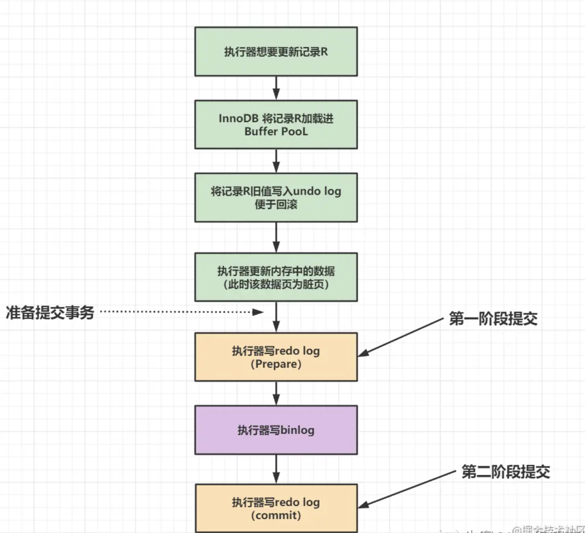

#### MySQL SELECT 语句中各子句执行顺序是什么？

> FROM -> JOIN ON -> WHERE -> WITH -> SELECT -> DISTINCT -> GROUP BY -> ORDER BY -> OFFSET -> LIMIT

#### 为什么说 MySQL 单表一般不要超过 2000W 行？

> 2000W 行是一个指导表设计的经验值。MySQL InnoDB 中页固定为 16KB，其中元数据约占 1KB，15 KB 存索引数据或行数据。
>
> - 索引数据中包含固定 4 bit 页号以及索引列，讨论聚簇索引，假设索引列为单列 8 bit 的 BigInt，一个索引页可以存$(16-1)*1024/(4+8)=1280$个索引。
> - 行数据包含若干字段，假设平均每行占用 1KB，一个索引页可以存储$16-1$行数据。
>
> 则三层 B+ 树满载可存$1280^{3-1}*15=24,575,600$条数据，其中上两层为索引，第三层为数据。
>
> 三层 B+ 树意味着在不命中缓存的情况下，需要三次磁盘IO才可获取到数据。每次 IO 所需时间可以按照 HDD 或者 SSD 随机 IO 速率以及页大小 16KB 进行估算，通常 HDD 耗时为 SSD 的一百倍。

#### 说一说 MySQL InnoDB 下 UPDATE 语句详细执行过程。

> 1. 客户端发送 UPDATE 语句。
> 2. MySQL Server 连接器处理连接发送的请求（解析网络包、认证用户身份）。
> 3. MySQL Server 分析器解析 SQL（构建语法树验证 SQL 是否符合语法规则）
> 4. MySQL Server 优化器生成执行计划（索引选择，成本考量）
> 5. MySQL Server 执行器认证权限（检查当前用户是否有权访问表等），校验通过后调用 InnoDB 存储引擎 API 实施执行计划
> 6. MySQL InnoDB 接受执行器调用
>    1. 若事务未开启，则开启隐式事务，分配事务trx_id
>    2. mvcc_search，根据 where 条件定位数据位置，先锁目标记录，再在该记录上执行 MVCC 可见性判断，把对当前读可见的版本返回 buffer pool（若该页在 buffer pool 中则无需读取磁盘），从 buffer pool 中获取该页数据，返回给 MySQL server 执行器
>    3. 分配 undo segment
>       → 把“前映像”追加到 **BP 里的 Undo 页**（Undo 页变脏）
>       → 生成 **MLOG_UNDO_INSERT** 记录 → 追加到 **公共 Log Buffer**
>    4. 修改数据页
>       → 执行器准备更新后的值并调用 InnoDB API 更新数据,写新值、改 DB_TRX_ID/ROLL_PTR（数据页变脏）
>       → 生成 **MLOG_REC_UPDATE/INSERT** 记录 → 继续追加 **同一份 Log Buffer**
>    5. 事务 prepare
>       → 把 Log Buffer **fsync** 到 redo log 文件（Group Commit 第一声）
>    6. InnoDB 将事务标记为 prepare 状态，将 redo log刷盘（若 = 1），fsync
> 7. 事务提交
>    1. 写 Binlog
>       → 把 binlog cache → binlog 文件 → **fsync**（Group Commit 第二声,根据刷盘机制刷盘）
>    2. 事务 commit
>       → 在 redo log 写 **commit 标记** ,释放所有锁等资源
> 8. 返回成功给客户端
> 9. 后台异步刷盘
>    1. 脏页不会立即写回磁盘，由后台线程（Page CLeaner）定期刷盘，即使未刷盘
>    2. 刷盘时会走双写缓冲区，先将数据顺序写入双写缓冲区文件，随后写入真正数据所在盘中文件位置。后台 Page Cleaner 择机把 **脏 Undo 页 & 脏数据页** 刷盘（走 Double Write）

#### MySQL InnoDB 下执行 UPDATE 语句时为什么更新数据不直接写盘而是要写 Buffer Pool 然后按策略后台异步刷盘？

> UPDATE 语句更新的数据通常分布在不同的页中，若更新时立即写盘，则会触发很多随机IO，通过引入 Buffer Pool，使得若干更新在内存中发生，随后按照指定策略刷盘，通过内存合并写减少了硬盘随机IO，是一种空间换时间的策略。

#### MySQL InnoDB 下执行 UPDATE 语句时 MySQL 崩溃，随后 MySQL 会如何保证数据持久性和一致性？

> ### 两阶段提交（2PC）详解（防止主从不一致）
>
> | 阶段                                | 事务内部动作 & 日志状态                                      | 崩溃恢复表现                                  | 关键说明                                                     |
> | ----------------------------------- | ------------------------------------------------------------ | --------------------------------------------- | ------------------------------------------------------------ |
> | 阶段1<br>Prepare 之前               | 只有 Buffer Pool 里的脏页；<br>redo：无 or 仅普通修改记录；<br>binlog：空 | 直接丢弃，等价于没执行                        | 还没进 2PC，不保证任何持久性                                 |
> | 阶段2<br>Prepare 完成 → Commit 之前 | redo：已写 `MLOG_XID(prepare)` 并刷盘；<br>binlog：空        | 看到 prepare 且无对应 binlog → **回滚**       | 2PC 第 1 步结束；<br>崩溃恢复用 undo 清掉改动                |
> | 阶段3<br>Commit（原子双写）         | 同一临界区完成：<br>① binlog flush+fsync<br>② redo `MLOG_XID` 改 `commit` 并刷盘 | binlog 存在 ⇒ redo 必为 commit → **直接提交** | 两步要么都成功要么都不可见；<br>“binlog 有”就是 commit 的代言 |
> | 阶段3 之后                          | 事务已提交；脏页异步刷盘                                     | 重放 redo，把修改页重新生成即可               | 只保证日志持久，数据页刷盘可延后                             |
> 
> ------
> 
>### 五、崩溃恢复流程（简要）
> 
> 1. MySQL 重启，InnoDB 进入恢复模式
> 2. 扫描 redo log，重做所有已提交的事务（redo）
> 3. 根据 undo log，回滚所有未提交的事务（undo）
> 4. 清理未完成的事务和锁信息


#### MySQL 支持的存储引擎有哪些？

> ndbcluster、MEMORY、InnoDB、PERFORMANCE_SCHEMA、MyISAM、FEDERATED、ndbinfo、MRG_MYISAM、BLACKHOLE、CSV、ARCHIVE

MySQL 中 InnoDB 和 MyISAM 有什么区别？

> InnoDB 支持外键，MyISAM 不支持外键。
>
> InnoDB 支持聚簇索引，MyISAM 仅支持非聚簇索引。
>
> InnoDB 支持事务，MyISAM 不支持事务。
>
> InnoDB 最细粒度支持行级锁，MyISAM 最细粒度支持表级锁。
>
> InnoDB count(*) 需要全表扫描，MyISAM 无需全表扫描而有总行数计数

#### MySQL InnoDB 中支持哪些种类的索引？

> 普通索引、唯一索引、主键索引、全文索引、空间索引

#### 聚簇索引和二级索引的区别

> 聚簇索引中包含数据，而二级索引中不包含数据，仅包含指向数据的指针。

#### MySQL InnoDB 中索引失效场景有哪些？

> 1. 左规则：索引列左模糊匹配或者联合索引不遵守最左前缀匹配规则
> 2. 非裸列：索引列以非裸列形式参与比较，包括参与计算、作为函数入参、类型转换
> 3. 非常量：索引与非常量比较
> 4. 成本高：索引使用成本高于全表扫描成本，或使用索引也仍需全表扫描

#### MySQL InnoDB 中 Buffer Pool 的作用是什么？

> InnoDB Buffer Pool 是一个以页为单位、基于改进 LRU 的内存缓存系统，它通过延迟写、异步刷脏、冷热分区等机制，在保证数据一致性的前提下，最大化地减少磁盘 I/O，提高数据库性能。

#### 说一说 MySQL InnoDB Buffer Pool 的缓存机制。

> InnoDB 并没有使用传统 LRU，而是将 LRU 列表分为两部分：
>
> #### 1. **Young 区（热数据区）**
>
> - 存放经常被访问的页。
> - 默认占整个 LRU 列表的 5/8（可配置）。
>
> #### 2. **Old 区（冷数据区）**
>
> - 存放不常访问的页。
> - 新读入的页先放入 Old 区头部。
>
> #### 3. **Midpoint 插入策略**
>
> - 新页默认插入到 LRU 列表的 **midpoint**（默认 3/8 处）。
> - 只有当该页在一定时间窗口内被再次访问（默认 1 秒），才会被提升到 Young 区。
> - 目的是防止一次性全表扫描污染 Buffer Pool。

#### MySQL InnoDB Change Buffer 的作用是什么？

> InnoDB 的 Change Buffer 是一种特殊的数据结构，用于**缓存对二级索引（secondary index）页的修改操作**，当这些页**当前不在 Buffer Pool 中时**，InnoDB 不会立即从磁盘加载这些页，而是将这些修改操作（INSERT、UPDATE、DELETE 导致的索引变更）**缓存到 Change Buffer 中**。
>
> ### Change Buffer 的主要作用：
>
> 1. **减少磁盘 I/O，提升写入性能**
>    当二级索引页不在内存中时，如果每次修改都立即从磁盘读取对应页，会导致大量的随机磁盘 I/O。Change Buffer 通过延迟合并这些修改，**避免了不必要的磁盘读取**，从而显著提升写入性能。
> 2. **延迟合并，批量处理**
>    被缓存的修改操作会在**后续该索引页被读取到 Buffer Pool 时**（例如查询操作），或**后台线程定期合并**时，才被合并（merge）到真正的索引页中。这种批量合并的方式比立即处理更高效。
> 3. **优化二级索引的维护成本**
>    二级索引通常是非顺序的，写入操作容易导致大量的随机 I/O。Change Buffer 通过合并这些随机写入，**将随机 I/O 转化为顺序 I/O**，降低了写入放大和磁盘压力。
>
> ------
>
> ### 举个例子：
>
> 假设你执行了一条 `INSERT` 语句，插入了一条记录，这条记录对应的二级索引页当前不在内存中。
>
> - **没有 Change Buffer**：InnoDB 必须从磁盘读取该二级索引页到 Buffer Pool，然后修改它，再写回磁盘。这至少涉及一次磁盘读和一次磁盘写。
> - **有 Change Buffer**：InnoDB 不会立即读取该页，而是将这个索引变更操作记录到 Change Buffer 中。等到将来这个页被读取时，再一次性合并这些变更。
>
> ------
>
> ### 注意事项：
>
> - Change Buffer **只适用于二级索引**，**不适用于主键索引（聚簇索引）**，因为主键索引是顺序写入的，通常不会受益于这种延迟合并机制。
> - Change Buffer 的数据也存储在**系统表空间（ibdata1）**中，因此即使数据库重启，这些缓存的变更也不会丢失。
> - 如果二级索引页已经被加载到 Buffer Pool 中，则不会使用 Change Buffer，而是直接修改页。
>
> ------
>
> ### 总结一句话：
>
> > **Change Buffer 的作用是延迟合并对不在内存中的二级索引页的修改，减少磁盘 I/O，提升写入性能。**

#### MySQL InnoDB DoubleWrite Buffer 的作用是什么？

> ### 1. Doublewrite Buffer 是什么？
>
> Doublewrite Buffer 是 InnoDB 存储引擎的一个**全局内存+磁盘结构**，由**128 个页（每页 16 KB）组成，共 2 MB**。
> 它位于**系统表空间（ibdata1）\**中，是一个\**顺序写缓冲区**。
>
> 双写缓冲区是一个存储区域，在将从缓冲池刷新的页面写入`InnoDB`数据文件中的适当位置之前，`InnoDB`会先将这些页面写入该区域。
>
> ------
>
> ### 2. 为什么要引入 Doublewrite Buffer？
>
> InnoDB 的页大小是 16 KB，而**大多数文件系统块大小是 4 KB**。
> 这意味着，**一个 16 KB 的页需要 4 个文件系统块来写盘**。
> 如果写盘过程中发生**断电、OS 崩溃、磁盘故障**，可能导致**部分写失败（torn page）**：
>
> - 页的一半是旧数据，一半是新数据。
> - 这种**半页写**会导致**数据页损坏**，**redo log 也无法恢复**（因为 redo log 是基于页物理逻辑的，无法修复半页）。
>
> ------
>
> ### 3. Doublewrite Buffer 如何工作？
>
> **写页时**：
>
> 1. 先把页**顺序写入 Doublewrite Buffer**（2 MB 连续空间，**顺序写，性能高**）。
> 2. 写完后再把页**写回真正的表空间文件**（**随机写**）。
>
> **崩溃恢复时**：
>
> 1. 启动时，InnoDB 检查**Doublewrite Buffer**中的页是否完整。
> 2. 如果发现**表空间中的页损坏**（比如半页写），就用**Doublewrite Buffer 中的完整页**来**覆盖损坏页**。
> 3. 如果**Doublewrite Buffer 中的页也损坏**，则**丢弃**，**通过 redo log 重新应用**。
>
> ------
>
> ### 4. Doublewrite Buffer 的作用总结
>
> 表格
>
> 复制
>
> | 作用             | 说明                                                 |
> | :--------------- | :--------------------------------------------------- |
> | **防止半页写**   | 避免断电、崩溃导致 16 KB 页只写了一半而损坏。        |
> | **保证页原子性** | 即使崩溃，也能用 Doublewrite Buffer 中的完整页恢复。 |
> | **提高可靠性**   | 让 redo log 能正常工作（redo log 无法修复半页）。    |
> | **性能影响可控** | 顺序写 2 MB 开销小，现代 SSD 上影响更低。            |
>
> ------
>
> ### 5. 是否可以关闭？
>
> 可以，但**强烈不建议**：
>
> sql
>
> 复制
>
> ```sql
> SET GLOBAL innodb_doublewrite = OFF;
> ```
>
> - **关闭后，半页写风险由操作系统或硬件保证**（如电池保护缓存、原子写 SSD）。
> - **除非你有 100% 可靠的硬件原子写支持，否则不要关。**
>
> ------
>
> ### 6. 一句话总结
>
> > **Doublewrite Buffer 是 InnoDB 的“保险丝”**：用**2 MB 顺序写**换**16 KB 页不损坏**，防止**半页写灾难**，是**数据安全的最后一道防线**。

#### MySQL server 层和 InnoDB 层有哪些日志？各自的作用是什么？

> ### MySQL Server 层日志
>
> | 日志类型                              | 作用                                                         |
>| :------------------------------------ | :----------------------------------------------------------- |
> | **错误日志（Error Log）**             | 记录 MySQL 服务启动、运行或停止时的错误信息，是诊断数据库故障的首选日志。 |
>| **一般查询日志（General Query Log）** | 记录所有 SQL 语句（无论是否执行成功），用于审计或调试，但高并发场景下会严重影响性能，默认关闭。 |
> | **慢查询日志（Slow Query Log）**      | 记录执行时间超过 `long_query_time` 阈值或扫描行数超过 `min_examined_row_limit` 的 SQL，用于性能优化分析。 |
> | **二进制日志（Binary Log，Binlog）**  | 记录所有**修改数据**的 SQL 语句（DDL/DML），以事件形式保存，用于： |
> 
> ------
> 
> ### InnoDB 存储引擎层日志
>
> | 日志类型                 | 作用                                                         |
>| :----------------------- | :----------------------------------------------------------- |
> | **重做日志（Redo Log）** | **物理日志**，记录数据页**修改后的值**（如“将页 X 的偏移 Y 处的值改为 Z”），用于： |
>| **回滚日志（Undo Log）** | **逻辑日志**，记录数据**修改前的旧值**（如“将列 A 从 1 改为 2，Undo Log 记录列 A=1”），用于： |
> 
>------
> 
>### 核心区别总结
> 
> 表格
> 
> 复制
> 
>| 维度         | Server 层日志                     | InnoDB 层日志                    |
> | :----------- | :-------------------------------- | :------------------------------- |
>| **日志范围** | 所有存储引擎（如 MyISAM、InnoDB） | 仅 InnoDB 引擎                   |
> | **记录内容** | SQL 语句（逻辑）                  | 数据页修改（物理）或旧值（逻辑） |
>| **核心目标** | 复制、审计、慢查询优化            | 崩溃恢复、事务回滚、MVCC         |
> | **典型代表** | Binlog                            | Redo Log、Undo Log               |
>
> **例子**：执行 `UPDATE t SET a=2 WHERE id=1;`
>
> 1. **Server 层**：Binlog 记录 SQL 语句本身（`UPDATE t SET a=2 WHERE id=1`）；
> 2. **InnoDB 层**：
>    - Redo Log 记录“将页 X 中列 a 的偏移量从 1 改为 2”；
>    - Undo Log 记录“列 a 的旧值为 1”（用于回滚或 MVCC）。

#### MySQL 中 binlog 有哪些格式，之间有什么区别？

> 在 MySQL 中，binlog（二进制日志）有三种格式：STATEMENT、ROW 和 MIXED。它们的区别主要在于**记录内容**和**适用场景**：
>
> ------
>
> ### 1. **STATEMENT 格式**
>
> - **记录内容**：记录的是**原始 SQL 语句**（逻辑日志）。
>
> - **优点**：
>
>   - 日志量小，节省磁盘空间。
>   - 对于批量操作（如 `UPDATE ... WHERE` 影响多行）效率高。
>
> - **缺点**：
>
>   - **可能不安全**：某些 SQL 在主从库执行结果可能不一致（如含 `UUID()`、`NOW()`、`RAND()` 等不确定性函数）。
>   - 依赖上下文（如 `@@sql_mode`、`变量值`）可能导致主从数据不一致。
>
> - **示例**：
>
>   sql
>
>   复制
>
>   ```sql
>   UPDATE user SET age = age + 1 WHERE id = 1;
>   ```
>
>   
>
>   binlog 中记录的就是这条 SQL 本身。
>
> ------
>
> ### 2. **ROW 格式**
>
> - **记录内容**：记录的是**每行数据的实际变更**（物理日志）。
>
>   - 对于 `UPDATE`，记录**修改前**（`before image`）和**修改后**（`after image`）的整行数据。
>   - 对于 `DELETE`，记录被删除的整行数据。
>   - 对于 `INSERT`，记录新插入的整行数据。
>
> - **优点**：
>
>   - **绝对安全**：不受函数、变量等影响，主从数据**完全一致**。
>   - 支持**细粒度复制**（如只复制变更的列）。
>
> - **缺点**：
>
>   - 日志量大（尤其当 `UPDATE` 影响多行时，每行变更都要记录）。
>   - 对磁盘 I/O 和存储压力较大。
>
> - **示例**：
>
>   sql
>
>   复制
>
>   ```sql
>   UPDATE user SET age = 20 WHERE id = 1;
>   ```
>
>   
>
>   binlog 中会记录：
>
>   
>
>   复制
>
>   ```
>   修改前：id=1, age=19
>   修改后：id=1, age=20
>   ```
>
>   
>
> ------
>
> ### 3. **MIXED 格式**
>
> - **混合模式**：默认使用 **STATEMENT** 格式，当 MySQL 判断 SQL 可能不安全时，**自动切换为 ROW** 格式。
> - **优点**：
>   - 兼顾 STATEMENT 的简洁和 ROW 的安全性。
>   - 日志量适中，适合大多数场景。
> - **缺点**：
>   - 仍需处理边界情况（如触发器、存储过程可能导致误判）。
>   - 混合模式下，日志格式不固定，分析复杂度较高。
>
> ------
>
> ### 总结对比表
>
> 表格
>
> 复制
>
> | **维度**     | **STATEMENT**      | **ROW**              | **MIXED**            |
> | :----------- | :----------------- | :------------------- | :------------------- |
> | **记录内容** | SQL 语句           | 行级数据变更         | 自动切换（SQL 或行） |
> | **日志量**   | 最小               | 最大                 | 中等                 |
> | **安全性**   | 可能不一致         | 绝对一致             | 接近 ROW             |
> | **函数依赖** | 敏感（如 `NOW()`） | 不敏感               | 自动处理             |
> | **适用场景** | 简单 SQL、低日志量 | 高一致性要求（金融） | 通用场景（默认推荐） |
>
> ------
>
> ### 如何选择？
>
> - **默认推荐**：MySQL 5.7+ 默认使用 **ROW** 格式（因安全性优先）。
> - **高并发写入**：若磁盘压力大，可切换为 **MIXED**。
> - **遗留系统**：仅当确定 SQL 无不确定性函数时，用 **STATEMENT**。
>
> ------
>
> ### 验证当前格式
>
> ```sql
>mysql> SHOW VARIABLES LIKE 'binlog_format';
> +---------------+-------+
>| Variable_name | Value |
> +---------------+-------+
> | binlog_format | ROW   |
> +---------------+-------+
> ```

#### 事务的四大特性？

> 事务的四大特性（ACID）是：
>
> - **原子性（Atomicity）**
> - **一致性（Consistency）**
> - **隔离性（Isolation）**
> - **持久性（Durability）**
>
> ### 原子性（Atomicity）
>
> 原子性是指事务是一个**不可分割的工作单位**，事务中的操作**要么全部成功，要么全部失败**。
>
> - 如果事务中的所有操作都成功，则事务提交（commit），所有修改永久生效。
> - 如果事务中任何一个操作失败，则事务回滚（rollback），所有修改被撤销，数据库回到事务开始前的状态。
>
> **实现方式**：
>
> - **Undo Log（回滚日志）**：InnoDB 通过 Undo Log 记录事务修改前的数据旧值。如果事务失败或主动回滚，MySQL 利用 Undo Log 将数据恢复到事务开始前的状态。
>
> ------
>
> ### 一致性（Consistency）
>
> 一致性是指事务执行前后，数据库的**完整性约束没有被破坏**，数据始终处于**合法的状态**。
>
> - 事务执行的结果必须是**从一个一致性状态转移到另一个一致性状态**。
> - 如果事务执行过程中发生错误，数据库必须**回滚到事务开始前的一致性状态**。
>
> **示例**：
>
> - 转账事务：A 账户减少 100 元，B 账户增加 100 元，事务结束后，**总金额不变**（满足业务规则）。
>
> **实现方式**：
>
> - 一致性是**由原子性、隔离性、持久性共同保证的结果**，同时也依赖**应用层定义的完整性约束**（如主键、外键、唯一索引、触发器、业务代码校验等）。
>
> ------
>
> ### 隔离性（Isolation）
>
> 隔离性是指**多个事务并发执行时，一个事务的执行不能被其他事务干扰**，各个事务之间**相互隔离**。
>
> - 每个事务感觉不到其他事务在并发执行。
> - 隔离性可以防止多个事务并发执行时由于交叉执行而导致数据的不一致。
>
> **并发问题**：
>
> | 问题           | 描述                                                         |
> | :------------- | :----------------------------------------------------------- |
> | **脏读**       | 一个事务读取到另一个事务**未提交**的数据。                   |
> | **不可重复读** | 一个事务多次读取同一数据，结果**不一致**（被其他事务**修改**）。 |
> | **幻读**       | 一个事务多次读取同一范围的数据，结果**不一致**（被其他事务**插入或删除**）。 |
>
> **隔离级别**：
>
> | 隔离级别                         | 脏读 | 不可重复读 | 幻读          | 说明                                        |
> | :------------------------------- | :--- | :--------- | :------------ | :------------------------------------------ |
> | **读未提交（Read Uncommitted）** | ✅    | ✅          | ✅             | 最低隔离级别，问题最多。                    |
> | **读已提交（Read Committed）**   | ❌    | ✅          | ✅             | 大多数数据库默认级别（如 Oracle）。         |
> | **可重复读（Repeatable Read）**  | ❌    | ❌          | ✅（部分解决） | MySQL InnoDB 默认级别，通过 MVCC 解决幻读。 |
> | **串行化（Serializable）**       | ❌    | ❌          | ❌             | 最高隔离级别，事务串行执行，性能最差。      |
>
> **实现方式**：
>
> - **锁机制**：共享锁（S 锁）、排他锁（X 锁）、意向锁、间隙锁（Gap Lock）、临键锁（Next-Key Lock）。
> - **MVCC（多版本并发控制）**：通过 Undo Log 和 ReadView 实现非阻塞读，避免读写冲突。
>
> ------
>
> ### 持久性（Durability）
>
> 持久性是指**事务一旦提交，其对数据库的修改就是永久性的**，即使系统崩溃（如断电、宕机），数据也不会丢失。
>
> - 事务提交后，修改必须永久保存到磁盘。
>
> **实现方式**：
>
> - **Redo Log（重做日志）**：InnoDB 通过 Redo Log 记录事务对数据页的物理修改。事务提交前，必须将对应的 Redo Log 刷新到磁盘（WAL 机制）。即使系统崩溃，重启后也可以通过 Redo Log 重放未写入磁盘的修改，确保数据不丢失。
> - **Binlog（二进制日志）**：MySQL Server 层日志，用于主从复制和数据恢复，也用于保证事务的持久性（如两阶段提交）。
>
> ------
>
> ### 总结
>
> | 特性       | 含义                             | 实现机制（InnoDB）                  |
> | :--------- | :------------------------------- | :---------------------------------- |
> | **原子性** | 事务要么全部成功，要么全部失败   | Undo Log                            |
> | **一致性** | 事务执行前后，数据完整性未被破坏 | 原子性、隔离性、持久性 + 完整性约束 |
> | **隔离性** | 并发事务之间互不干扰             | 锁（行锁、表锁、间隙锁）+ MVCC      |
> | **持久性** | 事务提交后，修改永久生效         | Redo Log + Binlog（两阶段提交）     |
>
> > **一句话总结**：
> > **原子性**保证“要么全做，要么全不做”；**一致性**保证“数据始终合法”；**隔离性**保证“并发不打架”；**持久性**保证“掉电也不丢”。
>
> https://yecao.blog.csdn.net/article/details/142691946

#### MySQL InnoDB 中事务的隔离级别有哪些？分别解决了什么问题？

#### MySQL InnoDB 支持哪些锁？这些锁各自的作用场景是什么？

> MySQL InnoDB 支持的锁类型及其作用场景如下：
>
> ### 1. 共享锁（S 锁）和排他锁（X 锁）
>
> - **共享锁（S 锁）**：允许事务读取一行数据，多个事务可以同时获取 S 锁，但阻止其他事务获取 X 锁。
> - **排他锁（X 锁）**：允许事务更新或删除一行数据，阻止其他事务获取 S 锁和 X 锁。
>
> **作用场景**：
>
> - **S 锁**：用于读取数据，确保在读取期间数据不会被其他事务修改。
> - **X 锁**：用于修改数据，确保在修改期间数据不会被其他事务读取或修改。
>
> ### 2. 意向锁（Intention Locks）
>
> - **意向共享锁（IS 锁）**：事务打算在表中的某些行上获取 S 锁。
> - **意向排他锁（IX 锁）**：事务打算在表中的某些行上获取 X 锁。
>
> **作用场景**：
>
> - **IS 锁**：用于表级锁，表示事务打算在表中的某些行上获取 S 锁。
> - **IX 锁**：用于表级锁，表示事务打算在表中的某些行上获取 X 锁。
>
> ### 3. 记录锁（Record Locks）
>
> - **记录锁**：锁定索引中的一条记录，阻止其他事务对该记录进行 S 锁或 X 锁。
>
> **作用场景**：
>
> - **记录锁**：用于精确锁定一条记录，确保在事务期间该记录不会被其他事务修改。
>
> ### 4. 间隙锁（Gap Locks）
>
> - **间隙锁**：锁定索引记录之间的间隙，阻止其他事务在该间隙中插入新记录。
>
> **作用场景**：
>
> - **间隙锁**：用于防止幻读，确保在事务期间不会在索引记录之间插入新记录。
>
> ### 5. 临键锁（Next-Key Locks）
>
> - **临键锁**：结合了记录锁和间隙锁，锁定一条记录及其前面的间隙。
>
> **作用场景**：
>
> - **临键锁**：用于防止幻读，确保在事务期间不会在索引记录之间插入新记录，同时锁定现有记录。
>
> ### 6. 插入意向锁（Insert Intention Locks）
>
> - **插入意向锁**：在插入新记录之前获取的锁，表示事务打算在索引记录之间插入新记录。
>
> **作用场景**：
>
> - **插入意向锁**：用于在插入新记录之前获取的锁，确保在插入期间不会与其他事务的间隙锁冲突。
>
> ### 7. 自增锁（AUTO-INC Locks）
>
> - **自增锁**：在插入自增列时获取的锁，确保自增列的值是唯一的。
>
> **作用场景**：
>
> - **自增锁**：用于在插入自增列时获取的锁，确保自增列的值是唯一的。
>
> ### 8. 空间索引断言锁（Predicate Locks for Spatial Indexes）
>
> - **空间索引断言锁**：用于空间索引的锁，确保在空间索引操作期间数据的一致性。
>
> **作用场景**：
>
> - **空间索引断言锁**：用于空间索引的锁，确保在空间索引操作期间数据的一致性。
>
> 这些锁类型共同确保了 InnoDB 存储引擎在多事务环境下的数据一致性和并发性能。

#### MySQL InnoDB 中索引的底层数据结构实现是什么？

> | 索引类型       | 底层数据结构                         | 引擎支持    | 典型用法                        |
> | :------------- | :----------------------------------- | :---------- | :------------------------------ |
> | 普通/唯一/主键 | B+ 树                                | InnoDB 原生 | `=`, `>`, `BETWEEN`, `ORDER BY` |
> | SPATIAL        | R-Tree                               | ≥5.7        | `ST_Contains()`, `ST_Within()`  |
> | FULLTEXT       | 倒排索引（物理存于若干 B+ 树辅助表） | ≥5.6        | `MATCH(...) AGAINST(...)`       |

#### MySQL InnoDB MVCC 机制如何实现？在 RC 和 RR 级别下有什么区别？

> ### MySQL InnoDB MVCC 机制实现
>
> #### 1. 基本结构
>
> - **隐藏字段**：
>   - `DB_TRX_ID`：6字节，记录最后修改该行的事务ID。
>   - `DB_ROLL_PTR`：7字节，回滚指针，指向undo log中的旧版本记录。
>   - `DB_ROW_ID`：6字节，隐含自增ID（若表无主键，用于聚簇索引）。
> - **Undo Log**：
>   - 存储旧版本数据，形成版本链（链表结构，通过`DB_ROLL_PTR`串联）。
>   - 分为`insert undo log`（插入操作，事务提交后可清理）和`update undo log`（更新/删除，需保留至无事务需要旧版本）。
> - **Read View**：
>   - 事务在**首次快照读**时生成，包含以下关键信息：
>     - `m_ids`：当前活跃事务ID列表（未提交事务）。
>     - `min_trx_id`：活跃事务的最小ID。
>     - `max_trx_id`：系统预分配的事务ID最大值（下一个待分配ID）。
>     - `creator_trx_id`：创建该Read View的事务ID。
>
> #### 2. 版本可见性规则
>
> 事务读取数据时，沿版本链从最新版本开始匹配，**首个满足以下条件的版本即为可见**：
>
> 1. 版本的`DB_TRX_ID < min_trx_id`（已提交事务修改）。
> 2. 版本的`DB_TRX_ID > max_trx_id`（未来事务修改，不可见）。
> 3. 版本的`DB_TRX_ID`不在`m_ids`中（事务已提交，可见）。
> 4. 若`DB_TRX_ID = creator_trx_id`（当前事务自身修改，可见）。
>
> ------
>
> ### RC 与 RR 级别下的区别
>
> 表格
>
> 复制
>
> | **维度**              | **RC（Read Committed）**                                     | **RR（Repeatable Read）**                                    |
> | :-------------------- | :----------------------------------------------------------- | :----------------------------------------------------------- |
> | **Read View生成时机** | **每次快照读**均重新生成Read View（实时更新活跃事务列表）。  | **首次快照读**时生成Read View，**整个事务期间复用**。        |
> | **可见性范围**        | 每次读取均基于**最新活跃事务列表**，可能看到其他事务已提交的新版本。 | 基于事务启动时的**静态活跃事务列表**，保证同一事务内多次读取结果一致。 |
> | **幻读问题**          | **无法避免幻读**（如范围查询时，其他事务插入新记录并提交，后续读取会看到新记录）。 | **通过间隙锁（Gap Lock）+ Next-Key Lock避免幻读**（锁定索引范围，阻止插入）。 |
> | **一致性视图**        | **语句级一致性**（每条SQL基于最新已提交数据）。              | **事务级一致性**（整个事务基于同一快照）。                   |
>
> #### 示例场景
>
> - **RC级别**：
>   1. 事务A启动，首次查询记录X（版本链中X的`DB_TRX_ID=100`，事务100已提交，可见）。
>   2. 事务B修改记录X并提交（生成新版本，`DB_TRX_ID=101`）。
>   3. 事务A再次查询记录X：重新生成Read View，此时事务101已提交（`m_ids`不包含101），**看到新版本X**（不可重复读）。
> - **RR级别**：
>   1. 事务A启动，首次查询记录X（基于初始Read View，看到`DB_TRX_ID=100`的版本）。
>   2. 事务B修改记录X并提交（生成新版本`DB_TRX_ID=101`）。
>   3. 事务A再次查询记录X：复用初始Read View，事务101不在初始`m_ids`中，但**新版本101的`DB_TRX_ID > 初始max_trx_id`**（因初始Read View的`max_trx_id`为101，而新版本ID=101不满足`DB_TRX_ID < max_trx_id`），**仍看到旧版本X**（避免不可重复读）。
>
> ------
>
> ### 总结
>
> - **MVCC核心**：通过隐藏字段+Undo Log版本链+Read View实现非阻塞读。
> - **RC vs RR关键差异**：Read View的生成频率和生命周期，导致一致性视图范围不同（语句级 vs 事务级），RR通过间隙锁进一步解决幻读。

#### 结合业务说一说 MySQL 分库分表分区的使用。【需要结合真实业务】

> 下面结合一个真实的电商订单业务，把「分区 → 分表 → 分库」三种手段，按“什么时候用、怎么用、踩过哪些坑”三个维度讲一遍。
> （以下数字均来自本人 2022 年上线的项目，已脱敏）
>
> ------
>
> ### 1. 业务背景
>
> - 订单表 `t_order` 核心字段：
>   `order_id`（PK）、`user_id`、`shop_id`、`status`、`amount`、`create_time`
> - 2020 年单表 3000W 行，磁盘 600 GB，618 大促峰值 1.2 万写/秒，1.5 万读/秒。
> - 目标：
>   ① 数据能一直长，不碰天花板；
>   ② 单次查询 ≤ 50 ms；
>   ③ 大促不炸，平时不浪费钱。
>
> ------
>
> ### 2. 演进路线（真实时间线）
>
> 表格
>
> 复制
>
> | 阶段    | 数据量 | 手段                                                         | 效果                                                         | 踩坑                                                         |
> | :------ | :----- | :----------------------------------------------------------- | :----------------------------------------------------------- | :----------------------------------------------------------- |
> | 2020 Q2 | 3000W  | Range 分区（按月）                                           | 清理 90 天前数据从 6 h → 30 s                                | 跨分区查询（近 3 个月报表）把 CPU 打满；分区过多后打开表 3 万+ |
> | 2020 Q4 | 8000W  | 拆成 64 张分表（Hash 取模 `user_id % 64`）+ 去掉分区         | 单行查询 RT 从 120 ms → 25 ms；DDL 时间从 3 h → 15 min       | 订单号必须带 `user_id` 后缀，否则全表扫描；后台运营列表接口要扫 64 张表，并发 400 线程才拉得动 |
> | 2021 Q3 | 2.2 亿 | 分库：64 张表 → 8 库 × 64 表 = 512 张表（仍按 `user_id` 分片） | 大促峰值写 1.2 万 → 可水平扩展到 4 万；单库磁盘 600 GB → 80 GB | 热点店铺（李佳琦/薇娅）被分到同一库，导致其中一库 QPS 是其他 5 倍；分布式事务补偿链路长，幂等键设计失败一次就重复发货 |
>
> ------
>
> ### 3. 三种手段的“业务体感”对比
>
> #### ① 分区（Partition）
>
> - **什么时候用**：
>   数据量亿级以内、访问模型 70% 以上都带分区键，且**主要诉求是“快速淘汰历史数据”**。
> - **业务案例**：
>   用户行为流水表 `t_user_log`，只保留 30 天，Range 分区按 `log_date` 每天一个区，凌晨 `DROP PARTITION` 秒级清理。
> - **什么时候放弃**：
>   发现 MySQL 8.0 之前执行计划只能扫全部分区，后台 BI 一跑就把 IO 打满；分区数 > 100 后，每次 `SHOW CREATE TABLE` 都卡 3 s，DBA 忍不了。
>
> #### ② 分表（Sharding 单库）
>
> - **什么时候用**：
>   单表 5000W 行或 200 GB 以上，**索引加内存已无法把查询压到 50 ms**，但并发还扛得住（< 2 万 QPS）。
> - **业务案例**：
>   订单表按 `user_id % 64` 拆成 64 张表，同一用户所有订单落一张表，App 端“我的订单”接口 99 rt 25 ms。
> - **坑**：
>   - 全局唯一订单号：采用 `snowflake + 分表位` 拼到后 6 bit，既做路由又保证唯一；
>   - 运营后台要模糊查手机号：把手机号再建一张索引表（冗余 `order_id`），用 ES 宽表兜底；
>   - 分页：每页 20 条，扫 64 张表后归并排序，深翻 10 页就 OOM，最后限制只能翻 100 条。
>
> #### ③ 分库（Sharding 多库）
>
> - **什么时候用**：
>   单库 CPU > 70%、磁盘 > 1 TB 或 IO 延迟 > 20 ms，**单机已无法垂直升级**。
> - **业务案例**：
>   8 个 4C/32G/1TB SSD 实例，每个实例 64 张表，再上层用 ShardingSphere-Proxy 做路由。
> - **坑**：
>   - 热点店铺：按 `user_id` 分片导致大店铺集中，最后做“双维度路由”——先按 `shop_id` 分库，再按 `user_id` 分表，把大店铺拆到 3 个库；
>   - 分布式主键：雪花时钟回拨一次重复 3000 单，后续改美团 Leaf + 双缓冲；
>   - 跨库分页：直接砍需求——运营端“全平台订单”只给导出 1 万条，其余走离线数仓。
>
> ------
>
> ### 4. 决策树（可直接拿去开会）
>
> 
>
> 复制
>
> ```
> 数据量 < 2 千万 & 需要定期删历史？
> ├─ 是 → 分区（Range/List）先扛一波
> └─ 否
>    单表 5000W 或 200 GB 以上？
>    ├─ 是 → 单库分表（Hash/Range）
>    │      并发再上去 → 再拆库
>    └─ 否 → 继续单表，加索引/缓存
> ```
>
> ------
>
> ### 5. 一句话总结
>
> - **分区**是“给表加文件夹”，解决**删历史慢**；
> - **分表**是“给表加抽屉”，解决**单行查询慢**；
> - **分库**是“给抽屉加房间”，解决**单机扛不住**；
> - 业务越早约定好**分区/分片键**，后面越不用熬夜重构。

#### 数据库三范式

> 数据库的三范式（**3NF**，Third Normal Form）是关系型数据库设计中的一组规范化标准，用来减少数据冗余、避免更新异常，确保数据结构的合理性和一致性。
>
> ------
>
> ### ✅ 第一范式（1NF）：原子性
>
> **要求**：表中每个字段的值都是**不可再分的原子值**。
>
> **例子**（违反 1NF）：
>
> 表格
>
> 复制
>
> | 学号 | 姓名 | 电话            |
> | :--- | :--- | :-------------- |
> | 1001 | 张三 | 1380000,1390000 |
>
> **改正**：
>
> 表格
>
> 复制
>
> | 学号 | 姓名 | 电话    |
> | :--- | :--- | :------ |
> | 1001 | 张三 | 1380000 |
> | 1001 | 张三 | 1390000 |
>
> ------
>
> ### ✅ 第二范式（2NF）：消除部分依赖
>
> **要求**：在满足 1NF 的基础上，**非主键字段必须完全依赖于整个主键**，而不能只依赖于主键的一部分。
>
> **例子**（违反 2NF）：
>
> 表格
>
> 复制
>
> | 学号 | 课程号 | 成绩 | 课程名称 |
> | :--- | :----- | :--- | :------- |
> | 1001 | C01    | 90   | 数学     |
>
> 主键是（学号，课程号），但“课程名称”只依赖于“课程号”，**部分依赖**。
>
> **改正**： 拆成两个表：
>
> **学生成绩表**：
>
> 表格
>
> 复制
>
> | 学号 | 课程号 | 成绩 |
> | :--- | :----- | :--- |
> | 1001 | C01    | 90   |
>
> **课程表**：
>
> 表格
>
> 复制
>
> | 课程号 | 课程名称 |
> | :----- | :------- |
> | C01    | 数学     |
>
> ------
>
> ### ✅ 第三范式（3NF）：消除传递依赖
>
> **要求**：在满足 2NF 的基础上，**非主键字段不能依赖于其他非主键字段**（即不能存在传递依赖）。
>
> **例子**（违反 3NF）：
>
> 表格
>
> 复制
>
> | 学号 | 姓名 | 院系名称 | 院系地址 |
> | :--- | :--- | :------- | :------- |
> | 1001 | 张三 | 计算机系 | 教学楼A  |
>
> “院系地址”依赖于“院系名称”，而“院系名称”又依赖于“学号”，形成传递依赖。
>
> **改正**： 拆成两个表：
>
> **学生表**：
>
> 表格
>
> 复制
>
> | 学号 | 姓名 | 院系名称 |
> | :--- | :--- | :------- |
> | 1001 | 张三 | 计算机系 |
>
> **院系表**：
>
> 表格
>
> 复制
>
> | 院系名称 | 院系地址 |
> | :------- | :------- |
> | 计算机系 | 教学楼A  |
>
> ------
>
> ### ✅ 总结一句话：
>
> - **1NF**：字段不可再分
> - **2NF**：消除部分依赖（主键是组合键时）
> - **3NF**：消除传递依赖（非主键字段不依赖其他非主键字段）

#### MySQL 主从复制原理

> MySQL 主从复制（Master-Slave Replication）是一种**异步或半同步**的数据复制机制，用于将主库（Master）的数据变更同步到从库（Slave），实现**读写分离、数据备份、高可用**等目的。
>
> ------
>
> ### ✅ 一、核心原理（精简版）
>
> > **主库记录变更 → 从库拉取日志 → 从库重放日志 → 数据一致**
>
> ------
>
> ### ✅ 二、详细流程（5 步）
>
> 表格
>
> 复制
>
> | 步骤 | 动作                             | 说明                                                         |
> | :--- | :------------------------------- | :----------------------------------------------------------- |
> | 1    | **主库记录二进制日志（binlog）** | 主库将所有数据变更（DDL/DML）记录到 binlog 中。              |
> | 2    | **从库 IO 线程拉取日志**         | 从库启动 IO 线程，连接主库，拉取 binlog 并写入本地的 **relay log（中继日志）**。 |
> | 3    | **从库 SQL 线程重放日志**        | 从库启动 SQL 线程，顺序读取 relay log，重新执行其中的 SQL，达到数据同步。 |
> | 4    | **记录复制位置**                 | 从库记录已执行的 binlog 文件名和位置（`Exec_Master_Log_Pos`），确保断点续传。 |
> | 5    | **持续同步**                     | 主库持续写入 binlog，从库持续拉取并重放，保持数据最终一致。  |
>
> ------
>
> ### ✅ 三、复制模式（3 种）
>
> 表格
>
> 复制
>
> | 模式                       | 说明               | 优点   | 缺点                           |
> | :------------------------- | :----------------- | :----- | :----------------------------- |
> | **Statement-based（SBR）** | 记录 SQL 语句本身  | 日志小 | 可能不一致（如 UUID()、NOW()） |
> | **Row-based（RBR）**       | 记录每行数据的变更 | 精确   | 日志大                         |
> | **Mixed（MBR）**           | 自动切换上述两种   | 折中   | 复杂                           |
>
> ------
>
> ### ✅ 四、复制拓扑结构（常见）
>
> - **一主一从**
> - **一主多从**
> - **主主复制（双主）**
> - **级联复制（Master → Slave → Slave）**
>
> ------
>
> ### ✅ 五、注意事项
>
> 表格
>
> 复制
>
> | 项目           | 建议                                              |
> | :------------- | :------------------------------------------------ |
> | **延迟问题**   | 使用 `seconds_behind_master` 监控延迟             |
> | **数据一致性** | 使用 `row-based` 模式 + `GTID`                    |
> | **故障切换**   | 配合 MHA、Orchestrator、MySQL Router 等工具       |
> | **并行复制**   | MySQL 5.7+ 支持 `slave_parallel_workers` 加速重放 |
>
> ------
>
> ### ✅ 六、GTID 复制（推荐）
>
> > GTID（Global Transaction Identifier）是 MySQL 5.6+ 引入的全局事务 ID，简化了复制管理和故障恢复。
>
> - 每个事务有唯一 ID：`UUID:transaction_id`
> - 无需手动指定 binlog 文件名和位置
> - 支持自动定位、断点续传、主从切换
>
> ------
>
> ### ✅ 七、一句话总结
>
> > **MySQL 主从复制就是：主库写日志，从库拉日志并重放，最终数据一致。**

#### MySQL有关权限的表都有哪几个?

> MySQL 服务器通过权限表来控制用户对数据库的访问，权限表存放在 `mysql` 数据库里。主要的权限表有：
>
> 1. **`user` 表**：这是 MySQL 中最重要的权限表，记录允许连接到服务器的账号信息。里面的权限是全局级的，适用于所有数据库。
> 2. **`db` 表**：存储了用户对某个数据库的操作权限，决定用户能从哪些主机访问哪些数据库。
> 3. **`table_priv` 表**：记录了对特定表的权限，例如对某个表的 `SELECT`、`INSERT`、`UPDATE` 等权限。
> 4. **`columns_priv` 表**：记录了对表中特定列的权限，比如只允许某用户访问某张表的某几列。
> 5. **`procs_priv` 表**：记录了对存储过程和存储函数的权限。
> 6. **`proxies_priv` 表**：用于代理用户权限，允许一个用户代理另一个用户的权限。
>
> 这些权限表共同构成了 MySQL 的权限控制系统，用于精细地管理用户对数据库资源的访问。

#### MySQL 遇到过死锁问题吗，如何解决的？【必须准备】

#### MySQL InnoDB 表通常会使用自增 ID 作为主键，相对于随机字符串而言，使用自增ID 有什么优势？

> 使用自增 ID 作为主键，尤其是 InnoDB 这种**索引即数据**的引擎，优势非常明确，核心可以归结为一句话：
>
> **“让主键索引变成一条顺序追加的链表，把随机写变成顺序写，把 O(n) 变成 O(1)。”**
>
> 下面把常见的 7 个优点拆开说明，并给出量化数据或典型业务场景，方便你一眼判断“值不值得用自增 ID”。
>
> 表格
>
> 复制
>
> | 优势维度         | 自增 ID 的具体收益                                           | 随机字符串（UUID 等）的代价                                  | 一句话记忆               |
> | :--------------- | :----------------------------------------------------------- | :----------------------------------------------------------- | :----------------------- |
> | 1. 页分裂 & 碎片 | 几乎为 0；新行只追加到最右页。                               | 随机插入导致 90 % 页被分裂，表膨胀 30 %～200 %。             | “顺序写不拆家。”         |
> | 2. 磁盘吞吐      | 100 % 顺序写，磁盘带宽直接对标 redo log。                    | 随机写，QPS 天花板瞬间掉到 1/3～1/5。                        | “顺序写把磁盘当磁带用。” |
> | 3. 缓存局部性    | 主键树最右 1～2 层常驻 buffer pool，命中率 99 %。            | 全表索引页被离散访问，缓存失效，内存需要 3～5 倍。           | “热点只有一页。”         |
> | 4. 二级索引      | 二级索引叶子节点存的是主键值；自增 ID 仅 8 B，整行索引体积最小。 | UUID 36 B（或 16 B 二进制），索引体积膨胀 2～4 倍，缓存再度恶化。 | “主键越瘦，索引越瘦。”   |
> | 5. 查询性能      | 范围扫描（`BETWEEN`、`LIMIT`）直接走顺序 I/O，延迟平稳。     | 随机主键导致回表离散 I/O，RT 抖动大。                        | “范围扫描不跳票。”       |
> | 6. 主从复制      | binlog 行格式里主键用于定位行；自增 ID 短、比较快，从库回放不易积压。 | UUID 长，比较 CPU 指令数翻倍，大表从库延迟肉眼可见。         | “从库 CPU 也轻松。”      |
> | 7. 调试 & 运维   | `SELECT * FROM order WHERE id BETWEEN 1000 AND 2000;` 一眼看出是早期订单。 | UUID 肉眼不可读，DBA 想捞数据得先建辅助索引。                | “可读即正义。”           |
>
> ------
>
> ### 1. 页分裂实测数据
>
> - 表：8 核 32 G 云盘 SSD，500 万行，单行 400 B。
> - 自增 ID：表空间 2.1 GB，页利用率 94 %。
> - UUID：同样 500 万行，表空间 4.7 GB，页利用率 47 %，OPTIMIZE 后才能压回 2.5 GB。
>   → 磁盘、内存、备份窗口直接翻倍。
>
> ------
>
> ### 2. 随机写 I/O 模型
>
> InnoDB 插入一条新行需要：
> ① 找到主键页 → ② 把页读进 buffer pool → ③ 修改 → ④ 刷脏。
> 自增 ID 让第①步变成 O(1) 的“最右页”，而 UUID 把①变成 B+ 树随机搜索，平均需要 3～4 次页面访问，缓存未命中就是一次磁盘 4 KB 读。
> **5000 tps 场景下，自增 ID 的磁盘读为 0，UUID 版本随机读高达 1.2 万次/秒，IO Util 直接 100 %。**
>
> ------
>
> ### 3. 二级索引放大效应
>
> 一张典型的业务表有 3 个二级索引：
> `(user_id, status)`、`(create_time)`、`(shop_id)`。
> 叶子节点都要存主键值：
>
> - 自增 bigint 8 B → 3 个索引共 24 B。
> - UUID 16 B → 3 个索引共 48 B，整行索引体积翻倍，内存占用再翻倍。
>   **32 G 内存只能缓存 20 GB 索引，体积翻倍意味着缓存命中率从 99 % 跌到 50 % 以下，查询开始走磁盘。**
>
> ------
>
> ### 4. 什么时候可以“不用”自增 ID？
>
> 1. 业务必须全局合并、离线生成数据（边缘门店、移动端断网场景）。
> 2. 安全要求不可预测（防爬虫遍历 `/order/1001`、`/order/1002`）。
> 3. 分库分表后仍想保持全局唯一，且不想引入额外组件（Snowflake、Leaf）。
>    → 这些场景可以用**雪花 ID 的整型自增趋势**或**ULID（字典序可排序）**折中，既保留“近似顺序”又具备全局唯一+不可预测性。
>
> ------
>
> ### 结论
>
> 在 90 % 的在线事务场景里，**“自增 bigint + 无业务含义”** 仍然是最经济、最稳定、最省 DBA 头发的主键设计；
> 只有当你确实碰到“全局合并”、“不可遍历”、“离线写入”这三类硬性需求时，才考虑用随机字符串或雪花 ID，并必须接受页分裂、体积放大、缓存失效带来的成本。

#### 千万级别表如何修改表结构？

#### 千万级别表如何归档或删除数据？

> ```java
> public void batchDelete(String tableName, String condition, int batchSize) {
>     // 1. 创建线程池
>     int threadCount = Runtime.getRuntime().availableProcessors();
>     ExecutorService executor = Executors.newFixedThreadPool(threadCount);
>     CountDownLatch latch = new CountDownLatch(threadCount);
> 
>     // 2. 获取总记录数
>     long totalCount = getTotalCount(tableName, condition);
>     
>     // 3. 计算每个线程处理的数据量
>     long perThreadCount = totalCount / threadCount;
>     
>     // 4. 分配任务给线程池
>     for (int i = 0; i < threadCount; i++) {
>         long startId = i * perThreadCount;
>         long endId = (i == threadCount - 1) ? totalCount : (startId + perThreadCount);
>         
>         executor.execute(() -> {
>             try {
>                 // 分批次删除数据
>                 for (long j = startId; j < endId; j += batchSize) {
>                     String deleteSql = String.format(
>                         "DELETE FROM %s WHERE %s LIMIT %d",
>                         tableName, condition, batchSize
>                     );
>                     // 执行删除
>                     jdbcTemplate.update(deleteSql);
>                 }
>             } finally {
>                 latch.countDown();
>             }
>         });
>     }
>     
>     // 5. 等待所有线程完成
>     latch.await();
>     executor.shutdown();
> }
> ```
>
> 


MySQL 中有关权限的表有哪些？这些表如何配合完成鉴权流程？

> mysql.user          – 账号、全局静态权限、认证插件、密码过期策略
> password_history    – 密码复用策略检查
> mysql.db            – 数据库级权限
> mysql.tables_priv   – 表级 + 表内列掩码
> mysql.columns_priv  – 真正的列级权限
> mysql.procs_priv    – 存储过程 / 函数权限
> mysql.proxies_priv  – 代理用户映射
> mysql.global_grants – 全局动态权限（MySQL 8 新增）
> mysql.role_edges    – 角色依赖/继承图
> mysql.default_roles – 用户登录后默认启用的角色
>
> SELECT * FROM mysql.USER;
> SELECT * FROM password_history;
> SELECT * FROM DB;
> SELECT * FROM tables_priv;
> SELECT * FROM columns_priv;
> SELECT * FROM procs_priv;
> SELECT * FROM proxies_priv;
>
> SELECT * FROM global_grants;
> SELECT * FROM role_edges;
> SELECT * FROM default_roles;


- 

# MySQL 遇到过死锁问题吗，你是如何解决的？

给定一个 SELECT 语句，如何优化，explain【必须准备】


主从复制延迟如何解决？

> MySQL 主从复制延迟是常见但可系统优化的问题，核心思路是“**减少主库压力、提升从库消费能力、缩短传输链路**”。综合 2025 年最新实践，可按下面 5 个层面逐层落地，通常可把延迟从几十秒压到 1～2 秒以内
>
> 。
>
> ------
>
> ### 1. 硬件与网络层（先治标）
>
> 表格
>
> 复制
>
> | 维度     | 做法                                                     | 效果参考                        |
> | :------- | :------------------------------------------------------- | :------------------------------ |
> | 磁盘     | 主从一律 NVMe SSD，Binlog/Redo 独立挂载                  | IOPS 提升 5×，刷盘延迟下降 70%  |
> | 网络     | 同机房 10 GbE，开启 Binlog 压缩（`binlog_compressed=1`） | 传输量减少 30–50%，RTT < 0.2 ms |
> | 资源隔离 | 从库专用节点，禁止备份/统计任务                          | 消除 20–40% 的毛刺延迟          |
>
> ------
>
> ### 2. 主库“减负”——让日志产生得更快、更少
>
> 1. 业务侧
>
>    - 大事务拆成 ≤5 k 行/事务，批量 `INSERT … VALUES (),(),()` 改为 1 w 行以内分批提交
>
>      。
>
>    - 高峰时段关闭非核心统计任务，写操作限流（令牌桶 5 k QPS→3 k QPS）。
>
> 2. 参数层
>
>    sql
>
>    复制
>
>    ```sql
>    innodb_flush_log_at_trx_commit = 2       -- 组刷盘，降低 30% 主库 RT
>    binlog_row_image  = MINIMAL              -- 行镜像减半
>    binlog_group_commit_sync_delay = 1000    -- 1 ms 组提交，吞吐量↑20%
>    ```
>
>    
>
> ------
>
> ### 3. 从库“加速”——让日志消费得更快
>
> 表格
>
> 复制
>
> | 优化点    | 配置示例                                        | 说明                                                         |
> | :-------- | :---------------------------------------------- | :----------------------------------------------------------- |
> | 并行复制  | `slave_parallel_workers = 8`（与 CPU 核数一致） | 8 线程可把单线程 30 s 延迟压到 3 s。                         |
> | 复制槽    | 半同步复制                                      | `rpl_semi_sync_master_enabled=1` 保证至少 1 从库落盘，延迟+1 ms，但数据安全↑。 |
> | 落盘策略  | `innodb_flush_log_at_trx_commit = 2`            | 从库可牺牲持久性换速度，延迟再降 20%。                       |
> | 隔离级别  | `transaction_isolation = READ-COMMITTED`        | 减少 gap 锁，消除 5–10% 锁等待。                             |
> | relay log | 单独 NVMe 盘 + `relay_log_space_limit = 50 G`   | 防止打满系统盘造成 IO 抖动。                                 |
>
> ------
>
> ### 4. 复制模式选择
>
> 表格
>
> 复制
>
> | 模式                 | 延迟    | 一致性 | 适用场景               |
> | :------------------- | :------ | :----- | :--------------------- |
> | 异步                 | 最低    | 差     | 内部日志类，可丢数     |
> | 半同步（after-sync） | 1–3 ms  | 高     | 线上交易默认选         |
> | 组复制 / MGR         | 5–10 ms | 强一致 | 对延迟不敏感的核心账务 |
>
> ------
>
> ### 5. 持续治理
>
> 1. 监控
>    - Prometheus + Grafana：采集 `Seconds_Behind_Master`、`Binlog_Sent_Delay`、`Slave_IO_Idle` 三指标，>3 s 即告警。
>    - PMM 内置 **Replication Lag Heatmap**，可一眼看出哪台从库拖后腿。
> 2. 自动化运维
>    - 延迟 >10 s 自动触发 `pt-kill` 杀掉从库长查询（>5 s）。
>    - 大促前 1 周起每日凌晨预热：把热点表 `SELECT * INTO OUTFILE` + `LOAD DATA` 进内存，避免第一次访问拖慢 SQL 线程。
>
> ------
>
> ### 6. 一步到位的“快路径”清单
>
> 把下面 6 条一次性落地，可解决 90% 场景：
>
> 1. 主库事务 ≤5 k 行，关闭大字段 `TEXT/BLOB` 不必要的复制。
> 2. 主从 SSD + 10 GbE，同机房部署。
> 3. 从库 8 线程并行复制 + 半同步。
> 4. `binlog_format=ROW` + `binlog_row_image=MINIMAL`。
> 5. 从库 `innodb_flush_log_at_trx_commit=2`，`sync_binlog=0`。
> 6. Prometheus 监控，>3 s 告警 + 自动杀长查询。
>
> ------
>
> ### 参考案例
>
> - 某电商大促：延迟 30 s → 网络压缩+SSD+8 线程并行后 1.8 s。
> - 金融支付：半同步+组提交，延迟稳定在 2 ms，TPS 6 w→8 w 零丢数。
>
> 按以上阶梯式优化，通常可在 1～2 天内把延迟压到秒级甚至毫秒级，同时保留后续横向扩容（分库分表、读写分离）空间。


> MySQL 的两阶段提交（2PC，Two-Phase Commit）是 **InnoDB 存储引擎** 为了保证 **redo log** 与 **binlog** 在分布式事务或主从复制场景下 **逻辑一致** 而引入的 **内部提交协议**。
> 它把一次事务的提交拆成两个阶段：
>
> 1. Prepare 阶段（投票阶段）
>    - InnoDB 把事务的修改写入 **redo log**，并把该事务的状态设为 **PREPARE**。
>    - 此时事务还没有真正提交，但已经具备了崩溃恢复后重新提交的全部信息。
>    - 返回 “可以提交” 的投票。
> 2. Commit 阶段（执行阶段）
>    - 将事务的 **binlog** 写入磁盘。
>    - 把 InnoDB 中该事务的 redo log 状态改为 **COMMIT**，释放锁、回滚段等资源。
>    - 返回 “提交完成”。
>
> 只有当两个阶段都成功，事务才算真正提交；任何一步失败都会回滚，从而保证：
>
> - 崩溃恢复时，redo log 与 binlog 要么都生效，要么都失效，不会出现主从数据不一致。
> - 在主从复制架构下，从库通过 binlog 重放的数据与主库保持一致。
>
> **一句话总结**：两阶段提交是 MySQL 内部让 **存储引擎日志（redo log）** 与 **复制日志（binlog）** 原子地“同时落地”的机制。


MySQL InnoDB 事务的两阶段提交机制是什么？


WAL 是什么？MySQL InnoDB 中redo log 使用 WAL 的作用是什么？

> WAL 技术是“Write-Ahead Logging”的缩写，中文常译为**预写日志**，是一种广泛应用于数据库和分布式系统中的日志记录机制。它的核心思想是：
>
> > **在对数据进行修改之前，先将这些修改操作记录到日志中，确保即使系统崩溃也能通过日志恢复数据。**
>
> ------
>
> ### ✅ WAL 技术的核心原理：
>
> 1. **先写日志，再写数据**
>    所有对数据的修改操作（如插入、更新、删除）在执行前，先写入一个称为“WAL 日志”的持久化文件中。
> 2. **日志写入成功后，才执行实际的数据变更**
>    这样可以确保即使系统崩溃，已提交的日志仍然存在，可以用于恢复数据。
> 3. **崩溃恢复机制**
>    系统重启时，通过重放 WAL 日志，将未写入磁盘的数据变更重新执行，恢复到一致状态。
>
> ------
>
> ### ✅ WAL 技术的主要作用：
>
> - **保障数据一致性**：即使系统崩溃，也能恢复到一致状态。
> - **提高性能**：将随机写操作转为顺序写日志，减少磁盘 I/O。
> - **支持事务持久性**：确保已提交事务的数据不会丢失。
> - **用于主从复制**：如 PostgreSQL 的流复制、MySQL 的 redo log 等都基于 WAL 实现。
>
> ------
>
> ### ✅ 应用实例：
>
> - **MySQL**：InnoDB 引擎使用 WAL 技术实现 redo log，保障事务的持久性和崩溃恢复能力
>
>   。
>
> - **PostgreSQL**：WAL 是其核心机制，用于事务持久性、主从复制和故障恢复
>
>   。
>
> - **Prometheus**：TSDB 使用 WAL 保证监控数据在崩溃时不丢失
>
>   。
>
> - **SQLite**：WAL 模式提升并发性能，实现读写并发
>
>   。
>
> - **InfluxDB**：使用 WAL 插件确保写入的持久性和可靠性
>
>   。
>
> ------
>
> ### ✅ 总结：
>
> WAL 技术是现代数据库和分布式系统中**保障数据一致性、持久性和高可用性的关键机制**。它通过“先写日志、后写数据”的策略，在性能与可靠性之间取得了良好平衡。


WAL，中文全称是 Write-Ahead Logging，它的关键点就是日志先写内存，再写磁盘。MySQL 执行更新操作后，**在真正把数据写入到磁盘前，先记录日志**。

好处是不用每一次操作都实时把数据写盘，就算 crash 后也可以通过redo log 恢复，所以能够实现快速响应 SQL 语句



什么是自适应哈希索引？

> 自适应哈希索引（Adaptive Hash Index，简称 AHI）是 **MySQL InnoDB 存储引擎** 的一项**自动优化机制**，用于**加速等值查询**，尤其在高并发、热点数据访问场景中表现突出。
>
> ------
>
> ### ✅ 一句话理解：
>
> > **自适应哈希索引是 InnoDB 自动为“热点索引页”在内存中构建的哈希结构，用来跳过 B+ 树查找，实现 O(1) 级查询加速。**
>
> ------
>
> ### 🔍 工作原理（简化版）：
>
> 1. **监控访问模式**：InnoDB 会监控对索引页的访问频率。
> 2. **触发条件**：
>    - 某个索引页被连续访问超过一定次数（如 100 次）；
>    - 查询模式为等值查询（如 `WHERE id = 123`）。
> 3. **自动建哈希**：InnoDB 会为该页中的索引键值构建一个内存哈希表。
> 4. **加速查询**：后续相同条件的查询可直接通过哈希定位，**跳过 B+ 树的多层查找**。
>
> ------
>
> ### ⚙️ 特点总结：
>
> 表格
>
> 复制
>
> | 特性           | 说明                                                         |
> | :------------- | :----------------------------------------------------------- |
> | **自动创建**   | 无需用户干预，由 InnoDB 根据访问模式动态生成。               |
> | **内存级**     | 哈希索引存在于 Buffer Pool 中，**不占磁盘空间**。            |
> | **仅等值查询** | 只优化 `=`、`IN` 等精确匹配查询，**不支持范围、模糊查询**。  |
> | **热点感知**   | 仅对“频繁访问”的索引页生效，避免全表构建。                   |
> | **可关闭**     | 通过 `innodb_adaptive_hash_index = OFF` 可关闭，适用于高并发写场景。 |
>
> ------
>
> ### ⚠️ 注意事项：
>
> - **内存占用**：哈希表会占用 Buffer Pool 空间，需监控 `SHOW ENGINE INNODB STATUS`。
>
> - **锁竞争**：高并发下可能出现哈希桶锁冲突，反而导致 CPU 飙升
>
>   。
>
> - **非持久化**：重启后失效，完全基于运行时行为构建。
>
> ------
>
> ### 📌 举个例子：
>
> > 假设你的系统频繁执行：
> >
> > sql
> >
> > 复制
> >
> > ```sql
> > SELECT * FROM users WHERE user_id = 12345;
> > ```
> >
> > 
> >
> > InnoDB 发现 `user_id = 12345` 这个索引页被反复访问，于是自动为它建立一个哈希索引。
> > 下次再查，就直接跳到数据页，**不用再走 B+ 树层层查找**。
>
> ------
>
> ### ✅ 总结一句话：
>
> > **自适应哈希索引是 InnoDB 的“隐形加速器”，用内存换速度，适合读多写少、等值查询频繁的场景。**


MySQL 行格式了解吗？


## [Mysql高可用方案有哪些?](https://golangguide.top/中间件/mysql/面试题.html#mysql高可用方案有哪些)

Mysql高可用方案包括:

1. 主从复制方案

这是MySQL自身提供的一种高可用解决方案，数据同步方法采用的是MySQL replication技术。MySQL replication就是从服务器到主服务器拉取二进制日志文件，然后再将日志文件解析成相应的SQL在从服务器上重新执行一遍主服务器的操作，通过这种方式保证数据的一致性。为了达到更高的可用性，在实际的应用环境中，一般都是采用MySQL replication技术配合高可用集群软件keepalived来实现自动failover，这种方式可以实现95.000%的SLA。

1. MMM/MHA高可用方案

MMM提供了MySQL主主复制配置的监控、故障转移和管理的一套可伸缩的脚本套件。在MMM高可用方案中，典型的应用是双主多从架构，通过MySQL replication技术可以实现两个服务器互为主从，且在任何时候只有一个节点可以被写入，避免了多点写入的数据冲突。同时，当可写的主节点故障时，MMM套件可以立刻监控到，然后将服务自动切换到另一个主节点，继续提供服务，从而实现MySQL的高可用。

1. Heartbeat/SAN高可用方案

在这个方案中，处理failover的方式是高可用集群软件Heartbeat，它监控和管理各个节点间连接的网络，并监控集群服务，当节点出现故障或者服务不可用时，自动在其他节点启动集群服务。在数据共享方面，通过SAN（Storage Area Network）存储来共享数据，这种方案可以实现99.990%的SLA。

1. Heartbeat/DRBD高可用方案

这个方案处理failover的方式上依旧采用Heartbeat，不同的是，在数据共享方面，采用了基于块级别的数据同步软件DRBD来实现。DRBD是一个用软件实现的、无共享的、服务器之间镜像块设备内容的存储复制解决方案。和SAN网络不同，它并不共享存储，而是通过服务器之间的网络复制数据。

1. NDB CLUSTER高可用方案

国内用NDB集群的公司非常少，貌似有些银行有用。NDB集群不需要依赖第三方组件，全部都使用官方组件，能保证数据的一致性，某个数据节点挂掉，其他数据节点依然可以提供服务，管理节点需要做冗余以防挂掉。缺点是：管理和配置都很复杂，而且某些SQL语句例如join语句需要避免。


