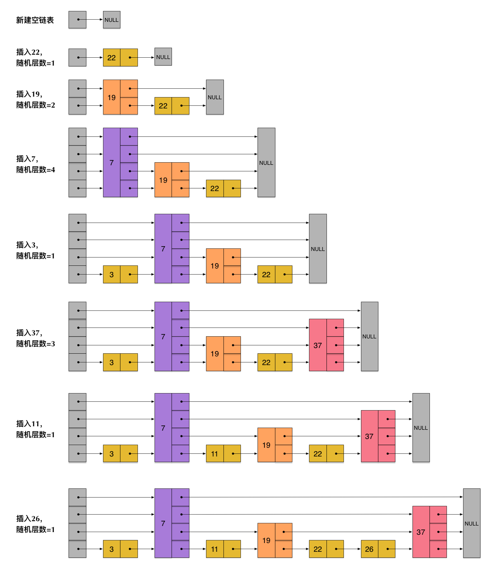

> PROMPT：你是一位资深开发工程师，精通redis业务使用、运维等等场景，我会问你一些面试题，你需要以候选人视角答复，要求回答体系完善，复合实际业务场景。

https://cloud.tencent.com/developer/article/1804603

https://pdai.tech/md/db/nosql-redis/db-redis-y-monitor.html

https://cloud.tencent.com/document/product/557/122953

#### Redis 为什么这么快？

> 1. 纯内存操作
> 2. 单线程 IO 多路复用监听和执行命令，避免锁竞争。多线程 IO 解决读写性能和后台操作。
>    - 3.x 及以前：纯单线程，accept->read->解析 RESP 协议 -> 执行命令 -> write 响应 -> 
>    - 4.x 及以后：UNLIKE、FLUSHDB ASYNC、FLUSHALL ASYNC。引入后台线程解决删除 big key 阻塞主线程问题，主线程依然负责网络 IO 和命令执行。
>    - 6.x 及以后：引入 IO 网络线程，主线程监听到连接后，交由IO线程读取和解析命令，
>      - 主线程还是**唯一执行命令**的线程；
>      - I/O 线程只干两件事：
>        - 把内核缓冲区→用户缓冲区（read + 协议解析）；
>        - 把响应缓冲区→内核缓冲区（write）。
>          实现细节：
>      - 每轮事件循环分成 3 个阶段：
>        ① 主线程 `epoll_wait` 收集就绪 fd → ② **并行读/解析**（I/O 线程） → ③ **串行执行命令**（主线程） → ④ **并行写回**（I/O 线程）。
>      - 用**无锁队列 + 原子计数**做阶段同步：I/O 线程把解析完的 `client->argv` 插进队列，主线程按 fd 顺序依次执行，**保证命令执行顺序=到达顺序**，无并发安全问题。
>        性能收益：
>    - 7.x 及以后：多线程 AOF 刷盘
> 3. 高效数据结构（SDS、ziplist、quicklist）

#### Redis 支持什么数据类型？说一说每种数据类型的底层实现。

> string：int 编码，基于 int，embstr，基于sds，头和数据在一块，str，sds
>
> list：quicklist（linklist+ziplist）
>
> hash：基于 ziplist 或者 hashtable
>
> set：基于 intset 或者 hasdtable
>
> zset：ziplist 或者 skiplist + dict

#### Redis 事务如何实现？MULTI/EXEC/WATCH 的原理和局限性？

> 原理：
>
> - MULTI：Redis 客户端发送 MULTI，Redis 服务端在 `client.flags` 里打开 `CLIENT_MULTI` 标志位，返回 OK。随后该 Redis 客户端发送其他命令，Redis 服务端不再立即执行该客户端的命令，而将其追加至`client.mstate.commands`动态数组（每个元素是 `multiCmd` 结构：指针+参数+argc）
> - EXEC：遍历 `client.mstate.commands`，依次调用 `call()` 执行；执行前 Redis 会“锁定”整个实例（单线程事件循环天然串行），所以这组命令在 Redis 时间线上是连续、不被打断的。
> - DISCARD：直接把 `mstate.commands` 数组清空、关闭 `CLIENT_MULTI` 标志即可，没有任何回滚动作。
> - WATCH：
>   - WATCH  key  会把当前 key 的 `redisDb->watched_keys` 链表挂上该 client，并把 client 记入 key 的 `redisObject->watched_clients` 反向链表。
>   - 每次对 key 做写操作时，`signalModifiedKey()` 会把挂在它上面的所有 client 打上 `CLIENT_DIRTY_CAS` 标记。
>   - 当 client 随后执行 EXEC 时，如果发现自身有 `CLIENT_DIRTY_CAS`，直接拒绝整个事务，返回 `nil`，达到“乐观锁”效果。
>
> 局限：
>
> 1. 命令串行化执行，但出错无法回滚
> 2. WATCH 只是乐观锁，不是阻塞锁，高冲突场景下会造成大量“重试”；需要业务层配合循环 + WATCH 重试
> 3. 集群模式下的限制，事务里所有命令必须**落在同一个 slot**（因为 Redis Cluster 把 key→slot→node 映射到单线程执行）。如果跨 slot，会收到 `-CROSSSLOT` 错误

#### Redis 中 pipeline 是什么？有什么用？

> Redis 中存在 mset、mget 等一次性可以操作多个 key 的命令，但是有些场景需要多个命令执行但没有批命令就需要多次网络请求。
>
> 在 Redis 中，**pipeline** 是一种**批量发送命令**的机制，允许客户端**一次性发送多个命令**，然后**一次性接收所有命令的返回结果**，而不需要像普通请求那样“发一条、等一条、再发一条”。pipeline 只是批量发命令，**不保证原子性**（中间可能被别的客户端插队）。


结合具体业务说一说 Redis 的使用场景。

> - 缓存
>
> - 排行榜
>
> - 计数器应用
>
> - 共享Session
>
> - 分布式锁
>
> - 社交网络
>
> - 消息队列
>
> - 位操作
>
> - Redis 如何在大模型、AI场景中应用？典型用法和优势有哪些？
>
>   > | 场景              | 命中率      | 延迟(P99) | 节省算力/成本   |
>   > | ----------------- | ----------- | --------- | --------------- |
>   > | Prompt 缓存       | 28 %        | 120 ms    | GPU 30 %        |
>   > | 特征存储          | —           | 2 ms      | 比 HBase 6 倍   |
>   > | 向量检索 400 万条 | 95 % Recall | 25 ms     | 成本 1/3 Milvus |
>   > | Streams 消息      | —           | 1 ms      | 替代 RabbitMQ   |
>   > | 模型权重缓存      | —           | 25 s 全量 | 冷启动↓80 %     |
>
>   
>
>   

#### 缓存击穿、缓存穿透、缓存雪崩分别指什么？如何解决？

> 缓存击穿（hot keys miss）
>
> - 含义：热点 key 过期，大量请求突发打入数据库
> - 解决：热点数据用不过期但定期刷新、熔断降级
>
> 缓存穿透（non-existent keys miss）
>
> - 含义：查询数据不存在导致无法缓存，尽管查询不到数据但是还是要打到数据库
> - 解决：1）缓存空值，2）布隆过滤器
>
> 缓存雪崩（large keys miss）
>
> - 含义：大批 key 同一时间过期，大量请求打入数据库
> - 解决：过期时间打散、多级缓存、Redis 高可用

#### 说一说 Redis 的内存淘汰策略

> | 策略名称            | 描述                                                         | 是否基于过期时间 |
> | ------------------- | ------------------------------------------------------------ | ---------------- |
> | **noeviction**      | 默认策略，**不淘汰任何数据**，返回错误（OOM）。              | 否               |
> | **allkeys-lru**     | 从**所有键**中使用 **LRU（最近最少使用）** 淘汰。            | 否               |
> | **volatile-lru**    | 从**设置了过期时间的键**中使用 **LRU** 淘汰。                | ✅                |
> | **allkeys-lfu**     | 从**所有键**中使用 **LFU（最少频率使用）** 淘汰。            | 否               |
> | **volatile-lfu**    | 从**设置了过期时间的键**中使用 **LFU** 淘汰。                | ✅                |
> | **allkeys-random**  | 从**所有键中随机淘汰**。                                     | 否               |
> | **volatile-random** | 从**设置了过期时间的键中随机淘汰**。                         | ✅                |
> | **volatile-ttl**    | 从**设置了过期时间的键**中，淘汰**TTL（剩余生存时间）最短**的键。 | ✅                |
>
> | 算法    | 淘汰依据     | 特点                                   |
> | ------- | ------------ | -------------------------------------- |
> | **LRU** | 最近使用时间 | 淘汰很久没访问的键                     |
> | **LFU** | 访问频率     | 淘汰访问次数最少的键（更适合热点数据） |
>
> | 使用场景                        | 推荐策略                         |
> | ------------------------------- | -------------------------------- |
> | 缓存系统，热点数据明显          | `allkeys-lfu` 或 `allkeys-lru`   |
> | 缓存+持久化混合，只淘汰缓存数据 | `volatile-lru` 或 `volatile-lfu` |
> | 所有数据都重要，不能淘汰        | `noeviction`（需监控内存）       |
> | 临时数据多，TTL 明确            | `volatile-ttl`                   |

#### 说一说 Redis 的持久化机制。

> ### 1. RDB（Redis Database Snapshot）
>
> #### 原理：
>
> - 定时把内存中的全量数据生成一个快照，保存为 `.rdb` 文件。
> - 是二进制压缩文件，体积小，恢复速度快。
>
> #### 触发方式：
>
> | 方式 | 说明                                                         |
> | :--- | :----------------------------------------------------------- |
> | 手动 | `SAVE`（阻塞）或 `BGSAVE`（fork 子进程，异步）               |
> | 自动 | 配置 `save m n`：如 `save 900 1` 表示 900 秒内至少有 1 次写操作就触发 |
>
> #### 优点：
>
> - 适合冷备份，文件紧凑，恢复快。
> - 对性能影响小（BGSAVE 是子进程做）。
>
> #### 缺点：
>
> - 可能丢数据：最后一次快照之后的修改会丢失。
> - fork 子进程时，内存翻倍（写时复制机制），对大数据集不友好。
>
> ------
>
> ### 2. AOF（Append Only File）
>
> #### 原理：
>
> - 把每次写操作（如 SET、DEL）以追加日志的方式记录到 `.aof` 文件中。
> - 重启时重放日志恢复数据。
>
> #### 同步策略（配置 `appendfsync`）：
>
> | 模式     | 说明                 | 性能 | 安全性          |
> | :------- | :------------------- | :--- | :-------------- |
> | always   | 每次写都刷盘         | 最慢 | 最安全          |
> | everysec | 每秒刷盘一次（默认） | 折中 | 最多丢 1 秒数据 |
> | no       | 由操作系统决定刷盘   | 最快 | 最不安全        |
>
> #### 优点：
>
> - 数据更安全，最多丢 1 秒数据（默认配置）。
> - 日志可读，可手动修改。
>
> #### 缺点：
>
> - 文件体积大，恢复速度慢。
> - 长期运行后日志会膨胀，需定期重写压缩。随着时间推移，AOF 持久化文件也会变的越来越大。为了解决此问题，Redis 提供了 bgrewriteaof 命令，作用是 fork 出一条新进程将内存中的数据以命令的方式保存到临时文件中，完成对AOF 文件的重写。
>
> ------
>
> ### 3. 混合持久化（Redis 5.0+ 推荐，AOF with RDB preamble）
>
> 如果执行bgrewriteaof命令，将内存中已有的数据以二进制格式存放在AOF文件中（模拟RDB），后续命令亦然采用AOF追加方式。
> 生产环境中一般采用两种持久化机制混合使用。将内存中数据快照存储在AOF文件中（模拟RDB），后续再以AOF追加方式。
> 如果仅作为缓存使用，可以承受几分钟数据丢失，可以使用RDB，对主程序性能影响最小。
>
> #### 原理：
>
> - 开启 `aof-use-rdb-preamble yes` 后，AOF 重写时会先写一份 RDB 快照，再追加增量命令。
> - 文件格式：RDB + AOF 混合，兼具两者优点。
>
> #### 优点：
>
> - 恢复速度快（RDB 部分）。
> - 数据更全（AOF 增量部分）。
>
> ------
>
> ### 4. 如何选择持久化策略？
>
> | 场景                     | 推荐策略                   |
> | :----------------------- | :------------------------- |
> | 缓存为主，可接受数据丢失 | 关闭持久化（或仅 RDB）     |
> | 数据重要，允许少量丢失   | AOF + everysec             |
> | 数据非常关键             | AOF + always（性能差）     |
> | 通用场景（官方推荐）     | RDB + AOF（混合） 同时开启 |
>
> ------
>
> ### 5. 配置示例（redis.conf）
>
> ```conf
> # RDB
> save 900 1
> save 300 10
> save 60 10000
> 
> # AOF
> appendonly yes
> appendfsync everysec
> aof-use-rdb-preamble yes
> ```
>
> ------
>
> ### 总结一句话：
>
> RDB 快但不全，AOF 全但慢，混合持久化是官方推荐的“又快又稳”方案。


#### Redis的数据一致性如何保证？

> Redis 通过一些机制来确保一定程度的一致性（不能保证强一致性）：
>
> 1. Redis事务：Redis支持事务机制，可以将多个命令在一个事务中执行，保证这些命令的原子性。在事务中，Redis会将所有命令缓存在一个队列中，然后按顺序执行。事务中的所有命令要么全部执行成功，要么全部执行失败，保证了数据的一致性。
> 2. 持久化机制：Redis提供了RDB和AOF两种持久化方式。RDB将内存中的数据定期保存到磁盘上的快照文件中，而AOF则将每个写操作追加到持久化文件中。通过启用持久化机制，可以在Redis重启或崩溃后，通过加载持久化文件来恢复数据，保证数据的持久性和一致性。
> 3. 主从复制：Redis支持主从复制机制，其中一个Redis实例作为主节点，其他实例作为从节点。主节点负责接收写操作，并将写操作的日志传播给从节点。从节点复制主节点的数据，并保持与主节点的数据一致。在主节点故障时，可以通过从节点提供读服务，保证数据的一致性。

#### Redis 主从会发生不一致情况吗？什么样的场景会发生以及如何解决？

> Redis 写命令在主节点执行并向客户端返回 OK -> 主节点后台异步将命令发给从节点，主要向客户端返回 OK 和真正同步到从节点之间有时间差，主从就可能不一致。
>
> 主从不一致场景：
>
> 1. 从节点被直接写入数据造成不一致
> 2. 主从复制延迟造成不一致
>    1. big key 同步操作（set 大字符串、flushall），从节点重放时间长导致不一致
>    2. 网络抖动／带宽打满 → 复制缓冲区堆积 → 从库落后几秒甚至几分钟。
>
> 主从复制延迟监控：
>
> redis-cli info replication
>
> 关注 master_repl_offset 和 slave_repl_offset
>
> redis-full-check
>
> 解决方案：
>
> 1. **读写分离策略优化**
>    - 实时性要求高的读，强制走主节点；
>    - 允许脏读的业务再走从节点；
>    - 或者客户端缓存写入结果，在"容忍时间窗"内就近读。
> 2. **从节点只读**
>    必须 `replica-read-only yes`，杜绝人为写从库。
> 3. **定期对账 & 自动修复**
>    离线扫描对比后，用 `DUMP`/`RESTORE` 或 `MIGRATE` 把差异 Key 重新同步；
>    对账频率视业务容忍度，一般小时级或天级即可。
> 4. 使用 Cluster 方案，分片数据，多主，降低单一主节点压力
> 5. 改用基于 Raft 的 KV（如 TiKV、RedRock）来替代原生 Redis

#### Redis 中什么是 hot key？如何发现？如何解决？

> 1. 什么是 hot key？
>    在 Redis 里，**hot key** 就是「某段时间内被超高并发访问的单个 key」，QPS 远高于其它 key，导致该 key 所在节点/CPU/网卡被打满，甚至拖垮整个集群。典型场景：秒杀库存、爆款商品、全局计数器、热点配置表。
>
> ------
>
> 1. 如何发现？
>    “线上 3 板斧”：
>
> 2. 实时采样 —— `redis-cli --hotkeys`（4.0+）或 `MONITOR | redis-faina` 快速定位；
> 3. 指标监控 —— `INFO commandstats` 看 `cmdstat_get`/`cmdstat_hget` 调用次数，配合 Prometheus+Grafana 做 Top Key 排行；
> 4. 客户端埋点 —— 在 SDK 层面对访问次数做 1% 采样，写到日志或消息队列，离线聚合并按 Key 排序。
>
> ------
>
> 1. 如何解决？
>    思路只有一句：**“把 1 个 key 的压力拆成 N 份”**。常用 4 招：
>
> 2. 分 key —— “**高频写 + 可累加/可合并 + 最终只需聚合结果**” 的场景都能用“分 key”拆热点。把 `item:123` 拆成 `item:123:{1..N}`，客户端按 `hash(uid)%N` 取分片。大V短视频点赞数统计，一个短视频分出来若干个
> 3. 分片 —— 上 Redis Cluster 或 Codis，让 hot key 落到不同 slot/节点；
> 4. 合并读：本地缓存 —— 在应用内存（Caffeine/Guava）缓存 hot key 数据，秒级过期，抗读流量；
> 5. 合并写：redis 之前做一个合并计算层，例如 flink，然后再写入 Redis。
> 6. 读写隔离 + 限流 —— 读走从节点，写回主节点；同时针对 key 做令牌桶限流，防止突发打爆。


Redis 主从复制的原理流程？全量同步与部分同步的区别是什么？

> 1. 建立连接
>    slave 配置 `replicaof <master_ip> <port>` 后，每秒轮询，发现需要复制就建立 TCP 连接，并发送 `PING` 保活。
> 2. 权限校验
>    slave 若配置了 `masterauth`，先发送 `AUTH`；master 返回 `+OK` 才能继续。
> 3. 协商同步方式 —— PSYNC
>    slave 发送
>    `PSYNC <replid> <offset>`
>    - 第一次复制时 `replid=? offset=-1`，退化为 `SYNC`，强制全量同步；
>    - 断线重连时 `replid` 与 `offset` 是上次的复制信息。
> 4. master 判断能否“部分同步”
>    依据：
>    a) 请求里的 `replid` 等于当前 master 的 `replid`；
>    b) `offset` 仍在 master 的复制积压缓冲区（`repl_backlog`）范围内。
>    同时满足 → 回复 `+CONTINUE`，走部分同步；否则回复 `+FULLRESYNC <new_replid> <offset>`，走全量同步。
> 5. 全量同步分支（Full Sync）
>    - master 执行 `bgsave`，生成 RDB 快照；
>    - 同时把新写入命令缓存在 “客户端输出缓冲区” 中；
>    - RDB 完成后，先把文件发给 slave，slave 先 `flushall` 清空旧数据，再加载 RDB；
>    - 最后 master 把 bgsave 期间的缓冲命令依次发给 slave，slave 重放，追上最新状态。
> 6. 部分同步分支（Partial Sync）
>    - master 只把 `repl_backlog` 中从 `offset` 到当前末尾的命令发给 slave；
>    - slave 逐条重放，即可追上，无需 RDB。
> 7. 进入“命令传播”阶段
>    之后 master 每执行一条写命令，就异步地通过该连接的 socket 发给所有 slave，slave 重放，实现最终一致。
> 8. 心跳与监测
>    master 每秒向 slave 发送 `REPLCONF ACK <offset>`，既做心跳又做复制偏移量确认；
>    如果 master 超过 `repl-timeout` 秒没收到某 slave 的 ACK，会认为该 slave 断线，关闭连接，等待重连。
>
> ## 二、全量同步 vs 部分同步
>
> 表格
>
> 复制
>
> | 维度           | 全量同步（Full Sync）              | 部分同步（Partial Sync / PSYNC）                          |
> | :------------- | :--------------------------------- | :-------------------------------------------------------- |
> | 触发场景       | 1. 第一次复制                      | 短暂断网、slave 重启但 RDB/AOF 还在，且 offset 仍在积压区 |
> | 数据量         | 整个 RDB 文件（GB~TB 级）          | 仅缺失的命令（KB~MB 级）                                  |
> | 耗时/资源      | 高：fork+bgsave、磁盘 IO、网络传输 | 低：纯内存复制，毫秒级追上                                |
> | 对 master 影响 | CPU、磁盘、网络突发压力            | 几乎无抖动                                                |
> | 依赖数据结构   | 无，只需 RDB                       | 复制积压缓冲区（环形缓冲区）+ 主从复制 ID                 |
>
> ## 三、关键结构与日志
>
> 1. `repl_backlog`
>    环形缓冲区，默认 1 MB（可 `repl-backlog-size` 调），保存最近 N 字节的写命令流。
>    主从复制 ID（`master_replid`）变化时（如 master 重启、故障转移），缓冲区会清空重填。
> 2. 复制偏移量（offset）
>    master 每发 1 字节复制数据，全局 `server.master_repl_offset++`；
>    slave 重放后把自己的 `slave_repl_offset` 汇报给 master，用于判断滞后多少。
> 3. 复制 ID（`replid`）
>    40 位伪随机字符串，代表“同一数据集演进历史”。只要数据集发生主备切换或 master 重启后数据被重写，ID 都会变，从而强制全量同步。
>
> ## 结论
>
> - Redis 主从复制先协商“能否只补缺失”，不能才退为“全量 RDB”；
> - 部分同步靠“环形积压区 + 复制偏移量 + 复制 ID”三要素；
> - 全量同步耗时长、开销大，线上应尽量调大 `repl-backlog-size` 并避免频繁 master 重启，以减少全量触发。

Redis Sentinel（哨兵）如何实现自动故障转移？有哪些关键组成部分和选举流程？

> Redis Sentinel（哨兵）实现自动故障转移的核心机制是通过**多哨兵协同监控、主观下线→客观下线判定、哨兵 Leader 选举、新主节点选举与晋升、客户端通知与旧主恢复后的角色降级**五个阶段完成的。以下按“关键组成部分”与“选举/转移流程”两大维度拆解：
>
> ------
>
> ### 一、关键组成部分
>
> 表格
>
> 复制
>
> | 组件/概念                | 作用与说明                                                   |
> | :----------------------- | :----------------------------------------------------------- |
> | **哨兵节点（Sentinel）** | 独立进程，负责持续监控 Redis 主从实例；至少部署 3 个且为奇数，避免脑裂。 |
> | **主观下线（SDOWN）**    | 单个哨兵在 `down-after-milliseconds` 内未收到主节点 PING 回复，即认为其“主观”下线。 |
> | **客观下线（ODOWN）**    | ≥ quorum 个哨兵均标记主节点 SDOWN，才正式判定为“客观”下线，触发后续选举。 |
> | **quorum**               | sentinel.conf 中配置的最小投票数，决定 ODOWN 与 Leader 选举门槛。 |
> | **Leader Sentinel**      | 由哨兵内部 Raft-like 投票产生，唯一负责本次故障转移的“执行者”。 |
> | **从节点筛选规则**       | 先剔除已断线、优先级为 0、复制偏移量过旧或网络质量差的从节点；再按 `slave-priority` → `repl_offset` → `runid` 字典序三轮比较，选出“最合格”新主。 |
> | **客户端通知**           | 通过 Pub/Sub 频道 `+switch-master` 推送新主地址，或客户端主动轮询 sentinel 获取当前主节点信息。 |
>
> ------
>
> ### 二、自动故障转移完整流程（含两轮投票）
>
> 1. **监控与 SDOWN 判定**
>    每个哨兵每秒对主从节点发送 PING；超时未响应 → 记为 SDOWN。
>
> 2. **ODOWN 判定（第一轮投票）**
>    发现 SDOWN 的哨兵向其他哨兵发送 `is-master-down-by-addr` 请求；
>    若累计赞成票 ≥ quorum，则标记主节点为 ODOWN
>
>    。
>
> 3. **哨兵 Leader 选举（第二轮投票）**
>    所有 ODOWN 的哨兵立即发起“竞选 Leader”投票；
>    规则：拿到**超过半数**哨兵赞成 **且** ≥ quorum 票者成为 Leader；
>    若未选出，则随机退避后重试，直至成功
>
>    。
>
> 4. **新主节点选举与晋升**
>    Leader Sentinel 执行：
>    ① 按前述筛选规则挑最佳从节点；
>    ② 向其发送 `SLAVEOF NO ONE` 解除从属；
>    ③ 提升为新主节点；
>    ④ 向其余从节点发送 `SLAVEOF 新主IP 端口` 完成复制切换
>
>    。
>
> 5. **配置传播与旧主降级**
>    Leader 通过 `+switch-master` 消息广播新拓扑；
>    待旧主重新上线，哨兵会向其发送 `SLAVEOF 新主IP 端口`，使其降为从节点，实现“自愈”
>
>    。
>
> ------
>
> ### 三、总结口诀（便于记忆）
>
> > “三哨兵、两投票、一 Leader；
> > 先 ODOWN、再选主、后通知；
> > 旧主上线变从库，故障转移全自动。”
>
> 通过以上机制，Redis Sentinel 可在**数十秒内**完成主节点故障检测与服务切换，无需人工介入，保障缓存层的高可用性。


#### 什么是缓存预热？缓存预热方案有哪些？

> 缓存预热（Cache Preheating）是指在系统正式启动并对外提供服务前，**预先将热点数据加载进缓存系统**（如 Redis、Caffeine、Memcached 等），以避免“冷启动”阶段缓存为空、请求全部穿透到数据库，从而导致响应慢、数据库压力大甚至雪崩的现象。其目标是：
>
> 1. **提升缓存命中率**；
> 2. **降低接口平均响应时间**；
> 3. **减轻后端存储负载**；
> 4. **平滑流量高峰**
>
> ------
>
> ### 一、缓存预热的典型方案
>
> 根据触发时机、数据选取策略与实现方式，可将业界常用方案归纳为以下几类：
>
> #### 1. 启动时静态预热
>
> - **描述**：应用启动瞬间（或容器初始化完成）即把全量/核心热点数据一次性写入缓存。
>
> - **实现**：
>
>   - Spring 可用 `CommandLineRunner` / `ApplicationRunner` / `InitializingBean` / `@PostConstruct` 等回调接口
>
>     ；
>
>   - .NET Core 可在 `IHostApplicationLifetime.ApplicationStarted` 注册事件
>
>     ；
>
>   - 脚本侧可在 Docker ENTRYPOINT 最后阶段执行 `redis-cli --pipe` 批量导入
>
>     。
>
> - **适用**：数据量可控、热点明确、启动时间要求不高。
>
> #### 2. 定时/周期预热
>
> - **描述**：通过 Crontab、xxl-job、`@Scheduled` 等定时任务，**循环地把热数据刷新到缓存**。
>
> - **实现**：
>
>   - 结合时间衰减算法或 LRU 统计，选取近期最频繁访问的数据
>
>     ；
>
>   - 可设置低峰时段（如凌晨 1 点）执行，避免影响在线流量
>
>     。
>
> - **适用**：热数据会随时间变化、需要长期保持缓存新鲜度的系统。
>
> #### 3. 事件/消息驱动预热
>
> - **描述**：业务侧产生变更事件（订单、新商品上架等）时，通过 MQ 发送消息，实时触发对应缓存更新。
>
> - **实现**：
>
>   - Kafka/RMQ 消费者监听到事件 → 调用数据聚合服务 → 写 Redis；
>
>   - 可与 Canal 等 binlog 订阅工具配合，实现“准实时”预热
>
>     。
>
> - **适用**：对时效性要求高、热点变化难预测的场景。
>
> #### 4. 按需/用时加载（懒加载升级版）
>
> - **描述**：不主动全量写入，而是在**首次请求到达且缓存未命中**时，通过加锁或异步线程只加载该热点，后续请求即命中。
>
> - **实现**：
>
>   - 分布式锁 + `redis.set(key, value, NX PX 3000)` 防击穿；
>
>   - Caffeine `refreshAfterWrite` 自动刷新
>
>     。
>
> - **适用**：数据维度巨大、无法一次性全预热，但想避免瞬时穿透。
>
> #### 5. 混合/分层预热
>
> - **描述**：本地缓存 + 分布式缓存多级组合，对不同层制定不同预热策略。
>
> - **实现**：
>
>   - 本地缓存采用“定时+懒加载”保持轻量；
>
>   - Redis 层采用“启动+事件”方式预置全站热点；
>
>   - CDN 边缘节点通过钩子（如 ZLMediaKit 的 `on_record_ts`）在切片生成时即回源预热
>
>     。
>
> - **适用**：高并发、多级缓存架构的大型系统。
>
> #### 6. 基于机器学习/预测的预热
>
> - **描述**：利用历史访问日志训练 LSTM、FP-Growth 等模型，**预测未来时段的热点**并提前写入缓存。
> - **适用**：活动（秒杀、直播）流量明显、可沉淀大量行为数据的场景。
>
> ------
>
> ### 二、选型建议
>
> 1. 数据量 < 全部内存且更新频率低 → 启动时全量预热；
> 2. 热数据随时间波动明显 → 定时任务 + 事件驱动组合；
> 3. 维度极多、无法全加载 → 用时加载 + 分布式锁防击穿；
> 4. 本地+Redis+CDN 多级存在 → 分层预热，每层策略独立；
> 5. 大促/直播等可预测高峰 → 事前跑批 + 实时事件双保险，可辅以 ML 预测。


#### Redis 如何作为消息队列使用？如何实现延迟队列？

> | 实现方式                | 核心命令                               | 优点                                      | 缺点                                                         | 适用场景                                   |
> | ----------------------- | -------------------------------------- | ----------------------------------------- | ------------------------------------------------------------ | ------------------------------------------ |
> | **List（LPUSH+BRPOP）** | LPUSH/RPUSH 入队，BLPOP/BRPOP 阻塞出队 | 简单、内存友好、支持阻塞读取              | 无 ACK、无回溯、单播（一条消息只被一个客户端 pop）           | 任务队列、秒杀下单、日志汇总               |
> | **Pub/Sub**             | PUBLISH / SUBSCRIBE                    | 原生广播，一条消息同时到所有订阅者        | 无持久化、无 ACK、无流量控速，消息不落盘，只实时推送给“已在线”的客户端。 | 实时通知、配置广播、低频事件               |
> | **Stream（≥5.0）**      | XADD / XREAD / XREADGROUP              | 支持消费组、ACK、消息回溯、阻塞读、持久化 | 命令相对复杂，需要理解 Consumer Group 概念                   | 严肃队列场景，可替代 Kafka/RabbitMQ 轻量版 |
>
> 1. Redis 可以基于 List 模拟消息队列，但无 ACK，单播。
> 2. Redis Pub/Sub 具有消息广播功能，但无 ACK，无持久化，消息推给“在线”的订阅者，无订阅者消息丢失。
> 3. Stream 是一个轻量级消息队列。
> 4. 基于 zset 存储消息，score 记录时间，业务线程每秒轮询 zset 处理到时间的消息。


#### Redis 管道（Pipeline）是什么？有什么用？

> 在某些场景下我们在**一次操作中可能需要执行多个命令**，而如果我们只是一个命令一个命令去执行则会浪费很多网络消耗时间，如果将命令一次性传输到 `Redis`中去再执行，则会减少很多开销时间。但是需要注意的是 `pipeline`中的命令并不是原子性执行的，也就是说管道中的命令到达 `Redis`服务器的时候可能会被其他的命令穿插
>
> 一次请求/响应服务器能实现处理新的请求即使旧的请求还未被响应，这样就可以将多个命令发送到服务器，而不用等待回复，最后在一个步骤中读取该答复。
> 这就是管道（pipelining），是一种几十年来广泛使用的技术。例如许多 POP3 协议已经实现支持这个功能，大大加快了从服务器下载新邮件的过程。

#### Redis 与 Memcached 相比各有什么优劣？

> 1. Memcached 仅支持字符串，Redis 支持 string、list、hash 等不同的数据结构。
>
> 2. Memcached 没有持久化机制，重启后数据丢失，Redis 有持久化机制，重启后可以恢复数据。
> 3. Memcached 集群无主从复制功能，由客户端实现一致性哈希，Redis 具有主从复制功能，基于服务端和哈希槽实现一致性哈希。


#### 为什么说 Redis 只用 0 号库。

> 多个 DB 是逻辑隔离，并非物理隔离，所有 DB 共享内存、CPU、网络带宽，故一个 DB 的慢查询会影响所有 DB 的操作。
>
> 拆分实例可以实现资源真正隔离，Cluster 模式中仅支持 db0，提前规划限制为仅用 0 号库是为后续迁移留下余地。
>
> 阿里云 Tair
>
> https://help.aliyun.com/zh/redis/support/what-is-the-size-of-each-database-on-an-apsaradb-for-redis-instance-and-how-can-i-choose-databases


> 10.如何保证缓存与数据库双写一致性
> ————————————————
> 版权声明：本文为CSDN博主「qq_30885871」的原创文章，遵循CC 4.0 BY-SA版权协议，转载请附上原文出处链接及本声明。
> 原文链接：https://blog.csdn.net/qq_30885871/article/details/142410809


#### 说一说 Redis 主从的同步机制。

> | 版本      | 关键特性                   | 备注                   |
> | --------- | -------------------------- | ---------------------- |
> | ≤ 2.6     | 只有 `SYNC` **全量复制**   | 断线就重来             |
> | 2.8 ~ 4.0 | 引入 `PSYNC1` **部分复制** | 新增 **backlog**       |
> | ≥ 4.0     | `PSYNC2` **混合复制 ID**   | **故障切换后也能增量** |
> | ≥ 7.0     | **无盘复制 + 多副本并行**  | 再省 IO、省内存        |
>
> 1. 全量同步
>
>    时机：从节点首次连接主节点，或者无法进行部分同步时，触发全量同步
>
>    流程：
>
>     	1. 从节点发送 psync ? -1 命令，表示请求全量同步
>     	2. 主节点执行 bgsave 由后台子线程生成当前数据 RDB 文件
>     	3. 主节点将 RDB 文件发送给从节点，从节点接受并加载 RDB 文件
>         	1. 若 bgsave 过程中有其他从节点也发起全量同步，则共用该 bgsave 生成的 RDB，
>     	4. RDB 同步期间主节点新执行的写命令被缓存在主节点与从节点的TCP连接输出缓冲区（client output buffer）中，每个从节点与主节点的连接都会有各自的缓冲区
>         	1. 若 bgsave 过程中有其他从节点也发起全量同步，则晚来的连接 TCP 输出缓冲区会从 rdb fork 点之后额外填充数据保证与第一个从节点一致
>     	5. RDB 重做完成后，主节点将输出缓冲区中写命令发送给从节点，从节点执行这些命令，完成全量同步
>     	6. 后续只要从节点与主节点保持连接，则一直可以基于 TCP 连接输出缓冲区完成命令重做，断线就走部分同步
>
> 2. 部分同步
>
>    时机：从节点短线重连主节点，且具备部分同步条件时，会进行部分同步
>
>    部分同步条件：
>
>    1. 从节点保存了主节点 run ID（主节点任期唯一标识）
>    2. 从节点记录了上次同步的复制偏移量（offset）
>    3. 主节点的复制积压缓冲区（repl_backlog_buffer）中仍包含从节点上次同步的复制偏移量之后的完整数据（即可以无缝接上数据断点）
>
>    流程：
>
>    1. 从节点发送 PSYNC <runid> <offset>
>    2. 主节点检查从节点的 run ID 是否为replid 或 replid2， offset 是否在  repl_backlog_buffer 中
>       1. 若不在，进行全量同步
>       2. 若在，主节点将 repl_backlog_buffer 中 offset 之后的命令发送给从节点，从节点执行命令，完成同步

#### 说一说 Redis 哨兵的高可用机制。

> Redis 哨兵（Sentinel）机制是 Redis 官方提供的高可用（HA）解决方案，核心目标有两个：
>
> 1. 持续监控主节点、从节点是否“活着”；
> 2. 当主节点发生故障时，**自动完成主从切换**，并将新主节点信息通知给客户端，实现**秒级故障转移**，整个过程无需人工干预。
>
> 下面按“角色-流程-原理-细节-坑点”五个维度把哨兵的高可用机制讲透。
>
> ------
>
> 一、角色划分
>
> 1. 数据节点
>    - 主节点（master）：负责读写
>    - 从节点（slave）：负责读、备份
> 2. 哨兵节点（Sentinel）
>    - 特殊 Redis 进程，**不存数据**，只跑哨兵逻辑
>    - 最少 3 个（奇数）才能形成可靠仲裁，防止“脑裂”
> 3. 客户端
>    - 传统做法：直连主节点 → 挂了就抛错
>    - 哨兵做法：先问哨兵“当前主节点是谁”，再连真正的主节点；故障转移后哨兵会推送新地址，客户端自动重连
>
> ------
>
> 二、故障发现流程（主观下线 → 客观下线）
>
> 1. 每个哨兵每秒向所有数据节点发 PING
> 2. 超过 down-after-milliseconds 无响应 → 标记 **sdown（主观下线）**
> 3. 哨兵互相交换“我认为 master 挂了”的投票
> 4. 当“赞成挂”的哨兵数 ≥ quorum（配置项） → 标记 **odown（客观下线）**，**真正触发故障转移**
>
> ------
>
> 三、故障转移步骤（选 leader → 选新主 → 晋升 → 通知）
>
> 1. 选哨兵 leader
>    基于 Raft 的“哨兵选举”算法，**只有一个哨兵负责本次 failover**，防止多人同时切主。
> 2. 选新主节点
>    过滤掉已下线、网络隔离、复制偏移量太小的从节点，按
>    (1) 优先级 replica-priority
>    (2) 复制偏移量 offset
>    (3) runid 字典序
>    排序，挑最优者。
> 3. 晋升
>    向被选中的 slave 发送 `SLAVEOF NO ONE`，将其升级成 master。
> 4. 重配置其余从节点
>    向其他正常 slave 发送 `SLAVEOF 新主 IP 端口`，让它们同步新主。
> 5. 通知客户端
>    哨兵在 Pub/Sub 频道 `+switch-master` 发布“主已切”消息；
>    支持哨兵协议的客户端（Jedis、lettuce、go-redis 等）收到后自动丢弃旧连接，重新初始化连接池。
> 6. 持久化新拓扑
>    哨兵把“新主是谁”写入自己的配置文件，下次重启仍然知道最新拓扑。
>
> ------
>
> 四、关键配置项（最简高可用模板）
>
> ```
> # sentinel.conf
> sentinel monitor mymaster 192.168.1.10 6379 2   # 2 表示至少 2 个哨兵认为 master 挂才 odown
> sentinel down-after-milliseconds mymaster 3000  # 3s 无响应即 sdown
> sentinel parallel-syncs mymaster 1              # 故障转移后，同时只允许 1 个 slave 去全量同步，避免新主被打爆
> sentinel failover-timeout mymaster 180000       # 单次 failover 最长 180s，超时放弃
> ```
>
> ------
>
> 五、客户端如何“无感知”切换
>
> 1. 初始化
>    客户端只给“哨兵地址列表”，不需要知道主节点 IP。
> 2. 运行时
>    客户端订阅哨兵推送的频道，收到 `+switch-master` 后，异步把连接池切换到新主。
> 3. 极端情况
>    如果切换瞬间客户端正好写入，旧连接会抛错；业务层捕获后快速重试即可，**最多丢 1 条**（取决于重试策略）。
>
> ------
>
> 六、脑裂与数据丢失
>
> 1. 场景
>    原主节点其实没挂，只是网络隔离，客户端仍然能写它；另一边哨兵已经提拔了新主，出现“双主”。
> 2. 缓解手段
>    - 把 `min-replicas-to-write 1` + `min-replicas-max-lag 10` 写在原主节点配置：
>      当主节点感知不到“至少 1 个 slave”且延迟 ≤10s 时，**拒绝写入**，降低脑裂期间数据分叉。
>    - 运维层面：哨兵放不同机架、不同 AZ，提高仲裁可靠性。

说一说 Redis 网络模型演变。

> | 版本阶段      | 模型                    | 关键变化                         | 说明                                                         |
> | ------------- | ----------------------- | -------------------------------- | ------------------------------------------------------------ |
> | **1.0 ~ 4.x** | **单线程 Reactor 模型** | `epoll` + 事件驱动               | 所有网络 I/O 和命令执行都在**一个主线程**中完成，**无多线程参与**。 |
> | **6.0+**      | **多线程 I/O 模型**     | 主线程 + I/O 线程池              | **命令执行仍是单线程**，但**网络读写**（read/write 系统调用）交由**I/O 线程池**并行处理，**主线程只负责解析和执行命令**。 |
> | **7.0+**      | **多线程 I/O 优化**     | I/O 线程可处理 TLS、更多协议解析 | 进一步 offload 主线程负担，**仍不并发执行命令**。            |


Redis 集群间通信采用什么机制，具体原理是怎么样的？

> 1. **客户端 ↔ 任何 Redis 实例**
>    应用层：RESP，传输层：TCP（6379）
> 2. **主从复制**（无论属于哪种部署形态）
>    应用层：还是 **RESP** 的复制子命令（PSYNC/SYNC、REPLCONF、PING），传输层：TCP（走 6379 或自定义端口）。
>    → 所以“主从场景纯 TCP”没错，但它**仍跑在 RESP 上**，不是裸 TCP。
> 3. **哨兵之间**
>    走 26379，应用层：在 RESP 基础上加了 3 条私有消息（hello/PING/拉票），传输层：TCP。
> 4. **Cluster 节点间**
>    - **Cluster Bus**（16379）：二进制私有帧，承载 Gossip 心跳与故障投票。
>    - **数据复制**：Cluster 里每个主从对**依旧用 RESP 复制命令**完成全量/增量同步，端口同普通主从一样走 6379（或你指定的端口）。
>      总结：“复制”永远走 **RESP over TCP**；只有 Cluster 为了 Gossip 才额外开了那条**二进制 Cluster Bus**。

Redis Cluster 的分片原理和数据分布机制？

> ### 一、数据分片原理
>
> 1. **哈希槽（Hash Slot）分片**
>    - 整个键空间被预先划分为 **16384 个槽**（0~16383）。
>    - 每个键通过 `CRC16(key) % 16384` 计算槽号，**槽是数据迁移与分配的最小单位**。
>    - 集群初始化时，各主节点按序领取一段连续槽位；扩容/缩容时，管理员或集群自动把槽整体迁出/迁入，无需搬动单个 key，效率更高。
> 2. **解耦数据与节点**
>    - 槽与节点的映射单独维护，客户端缓存该映射后可**直接定位节点**，减少转发跳数。
>    - 由于槽数量固定，映射表体积小（仅 16 KB），广播成本低，利于 Gossip 协议快速收敛。
> 3. **数据倾斜应对**
>    - 若业务存在热点 key，可人为在 key 名中嵌入 `{hash_tag}`，使相关键落入同一槽，**保证事务与批量操作的原子性**，同时便于针对性迁移槽来打散热点。
>
> ------
>
> ### 二、数据分布与路由机制
>
> 1. **客户端重定向**
>    - 若客户端请求打到错误节点，该节点返回 `MOVED slot IP:PORT`，客户端更新本地映射后再次请求；**首次重定向即命中**。
>    - 正在迁移中的槽返回 `ASK`，引导客户端仅本次请求跳至目标节点，**保证迁移期间读写一致性**。
> 2. **去中心化架构**
>    - 无代理、无单点调度器；各节点通过 **Gossip 协议** 两两交换「槽位表、节点存活状态」等信息，**最终一致**维护同一份集群拓扑。
>    - 新节点加入、节点失效、槽位变更都通过 Gossip 增量传播，**收敛时间在百毫秒级**。


#### 设计一套 Redis 多机房或跨地域高可用架构方案。

> | 方案         | 主节点分布                      | 写能力     | 用途                       |
> | ------------ | ------------------------------- | ---------- | -------------------------- |
> | **单地主写** | 北京 3 主 x 从，上海 0 主 y 从  | 只能写北京 | 容灾备份，上海平时不服务写 |
> | **双地双活** | 北京 2 主 x 从 + 上海 1 主 y 从 | 两地都能写 | 就近写，容灾，资源利用高   |


#### 如何监控和解决 Redis 的慢查询？

> 慢日志
>
> ```
> client 发送命令
>         │
>         ▼
> epoll_wait 返回
>         │
>         ▼
> processCommand()
>         │
>         ├─→ 执行命令
>         │        │
>         │        ▼
>         │     计算 duration
>         │        │
>         └─←  slowlogPushEntryIfNeeded()
>                  │
>                  ├─ slowlogCreateEntry
>                  ├─ 头插 server.slowlog 链表
>                  └─ 超长度则删 tail
> ```
>
> - slow log 为纯内存存储，断电丢失，达到存储上限新纪录覆盖旧记录，故需要及时将 slow log 持久化到三方存储
> - 把 `slowlog-max-len` 调到 4096；
> - 用 `SLOWLOG GET` 每 10 s 刷到 ELK；
> - 在 Entry 里利用 `cname` 字段记录 trace_id，方便链路追踪。”
>
> 1. 采集
>
>    打开慢查询日志
>
>    ```
>    # redis.conf
>    slowlog-log-slower-than 10000        # 单位 µs，10 ms
>    slowlog-max-len 2048                 # 内存循环队列长度，建议 2k~4k
>    ```
>
>    慢查询日志采样
>
>    ```
>    SLOWLOG GET 50                       # 取最近 50 条
>    SLOWLOG LEN                          # 当前队列长度
>    SLOWLOG RESET                        # 治理完后清理，防止旧数据干扰
>    ```
>
>    慢查询日志持久化
>
>    每台节点起个 Exporter 进程，把 SLOWLOG GET 转成 Prometheus metric（见下文），落盘的同时直接入 TSDB
>
>    Exporter 实现：用 Python+redis-py 每 10 s 抓一次 SLOWLOG，把 command 字段正则拆成 cmd（如 GET、MGET、ZUNIONSTORE），key 字段做哈希脱敏后上报，防止标签爆炸。
>
> 2. 指标统计
>
>    | 指标名                       | 类型      | 标签示例               | 说明                                     |
>    | ---------------------------- | --------- | ---------------------- | ---------------------------------------- |
>    | redis\_slowlog\_last\_id     | Gauge     | {cluster,node,ip,port} | 最新慢查询 ID，可判断是否有新增          |
>    | redis\_slowlog\_count\_rate  | Counter   | {cluster,node,cmd}     | 单位时间内新增慢查询条数，方便告警“突增” |
>    | redis\_slowlog\_duration\_ms | Histogram | {cluster,node,cmd}     | 慢查询耗时分布，P99/P95                  |
>    | redis\_slowlog\_key\_size    | Gauge     | {cluster,node,cmd,key} | 对应 key 的内存字节数，辅助判断大 key    |
>
> 3. 告警
>
>    1. 阈值类
>       - 过去 5 min 某节点新增慢查询 > 100 条且 P99 > 200 ms → 立即电话。
>    2. 环比类
>       - 慢查询数量环比上小时增长 3 倍 → 钉钉@值班。
>    3. 业务类
>       - 如果 `cmd=ZUNIONSTORE` 且 `duration>500 ms` 且 `key_size>100 MB` → 直接标红，提示“大 key + 复杂聚合”。
>
> 4. 定位整改
>
>    指标相关元信息需要记录。
>
>    1. 人
>       在客户端封装一层 SDK，把 `trace_id + uid + 业务线` 放到 `CLIENT SETNAME` 里，慢查询日志里就能拿到来源。
>
>    2. key
>       把 `key_size` 指标打到 Grafana，点一下慢查询面板就能跳转到 “BigKey 热力图”，直接看到哪个 key 在膨胀。
>
>    3. 命令
>       对 `ZUNIONSTORE、LRANGE 0 -1、KEYS *` 这类高危命令做静态审计，出现即治理；
>       对 `HGETALL` 这种“合法但可能慢”的命令，用 `FIELD` 数量做二次校验：
>
>       ```
>       HLENT key > 5000 → 强制走只读从节点 + 分页接口。
>       ```
>
> 5. 观察反馈
>
>    “上周 P99 120 ms → 本周 35 ms，节省 30% 物理机 CPU”，用数据让老板愿意持续投入人力。


#### Redis 主从延迟过大如何排查？哪些配置和场景容易导致延迟？

> 监控中集群延迟指标

#### 如果 Redis 集群大规模故障，你的应急预案是什么？如何快速恢复业务？

> 待补充

#### 缓存预热方案。

> | 触发方式                     | 典型场景               | 优点                             | 缺点                                       | 是否需改业务代码 |
> | ---------------------------- | ---------------------- | -------------------------------- | ------------------------------------------ | ---------------- |
> | **CI/CD pre-deploy**         | 云原生、K8s 滚动发布   | 与版本一起灰度、一键回滚         | 只解决“版本冷启动”，对运行期冷数据无能为力 | ❌                |
> | **应用启机自预热**           | 传统虚拟机、镜像不可变 | 无外部依赖，Pod 启动 10 s 内完成 | 可能多台并行打爆 DB，需本地限流            | ✅ 少量           |
> | **定时调度（cron/xxl-job）** | 日报/月报类周期性热点  | 可按业务峰谷弹性调度             | 预热与实时间隙可能错位                     | ❌                |
> | **运行时实时补热**           | 大促、突发直播         | 按需加载，命中率最经济           | 实现复杂，需埋点 + 异步线程池              | ✅ 较多           |
>
> 1. 能改流水线、发布频度高的——优先放 CI/CD，干净。
> 2. 老旧系统、不能随意滚动——选“启机自预热”+ 本地限流。
> 3. 数据热点明显且周期可预测——用定时任务兜底。
> 4. 热点完全不可预测（秒杀、热搜）——靠运行时补热，前三者只做基础层。
>
> 总结：
> “CI/CD 预热是‘版本级’保险；真正让缓存常年 80° 的是‘定时 + 实时’双兜底，四条路按业务能接受的风险和代码改造成本自由组合，没有银弹。”

#### 缓存一致性方案。

> 4、先删后写还是先写后删？
> 先删缓存后写 DB
> 产生脏数据的概率较大（若出现脏数据，则意味着再不更新的情况下，查询得到的数据均为旧的数据）。
>
> 比如两个并发操作，一个是更新操作，另一个是查询操作，更新操作删除缓存后，查询操作没有命中缓存，先把老数据读出来后放到缓存中，然后更新操作更新了数据库。于是，在缓存中的数据还是老的数据，导致缓存中的数据是脏的，而且还一直这样脏下去了。
>
> 先写 DB 再删缓存
> 产生脏数据的概率较小，但是会出现一致性的问题；若更新操作的时候，同时进行查询操作并命中，则查询得到的数据是旧的数据。但是不会影响后面的查询。
>
> 比如一个是读操作，但是没有命中缓存，然后就到数据库中取数据，此时来了一个写操作，写完数据库后，让缓存失效，然后之前的那个读操作再把老的数据放进去，所以会造成脏数据。
> ————————————————
> 版权声明：本文为CSDN博主「程序猿周周」的原创文章，遵循CC 4.0 BY-SA版权协议，转载请附上原文出处链接及本声明。
> 原文链接：https://blog.csdn.net/adminpd/article/details/122934938
>
> 10.如何保证缓存与数据库双写一致性
> 一、先更新数据库，再更新缓存
> 流程
> 当数据发生变化时，先更新数据库中的数据。
> 成功更新数据库后，再更新缓存中的数据。
> 问题
> 这种方式可能会出现数据不一致的情况。例如，在并发场景下，两个线程同时进行更新操作。线程 A 先更新了数据库，然后线程 B 也更新了数据库并接着更新了缓存。此时，线程 A 再去更新缓存，就会导致缓存中的数据是旧数据，与数据库不一致。
>
> 二、先删除缓存，再更新数据库
> 1、流程
> 数据更新时，先删除缓存中的数据。
> 然后更新数据库中的数据。
> 2、问题
> 在并发场景下可能会出现问题。例如，一个线程 A 要更新数据，先删除了缓存。此时，另一个线程 B 读取数据，由于缓存中没有数据，它会从数据库中读取旧数据并放入缓存。然后线程 A 更新数据库，就导致缓存中的数据与数据库不一致。
> 3、解决方案（延迟双删）
> 先删除缓存。
> 更新数据库。
> 休眠一段时间（例如几百毫秒，具体时间根据业务场景和性能测试确定）。
> 再次删除缓存。这样可以尽量避免在数据库更新后、缓存删除前的这段时间内有读操作导致缓存和数据库不一致。
>
> 三、先更新数据库，再删除缓存
> 1、流程
> 数据更新时，先更新数据库中的数据。
> 成功更新数据库后，再删除缓存中的数据。
> 2、优点
> 相比先更新缓存的方式，这种方式在大多数情况下可以保证最终一致性。即使在并发场景下出现问题，也只会导致缓存中数据暂时不一致，但后续的读操作会从数据库中读取最新数据并更新缓存，从而恢复一致性。
> 3、问题及解决方案
> 可能出现的问题是如果更新数据库成功，但删除缓存失败，会导致数据不一致。可以采用重试机制来解决这个问题，例如将删除缓存的操作放入消息队列，由专门的消费者进行重试，直到删除成功为止。

#### MySQL 里有 2000w 数据，Redis 中只存 20w 的数据，如何保证 redis 中的数据都是热点数据？

> Redis LFU 自动驱逐

#### 假如 Redis里面有1亿个key，其中有10w个key是以某个固定的已知的前缀开头的，如果将它们全部找出来？

> | 方案                    | 命令/工具                          | 耗时(1 亿 key 实测) | 内存/阻塞 | 代码量 | 备注             |
> | ----------------------- | ---------------------------------- | ------------------- | --------- | ------ | ---------------- |
> | ① KEYS 前缀             | `KEYS prefix:*`                    | 120 s+              | 全程阻塞  | 1 行   | 仅测试库可用     |
> | ② SCAN + 客户端过滤     | `SCAN 0 MATCH prefix:* COUNT 1000` | 42 s                | 无阻塞    | 10 行  | 最通用           |
> | ③ SCAN + Lua 服务端过滤 | `EVAL lua 0 prefix`                | 35 s                | 无阻塞    | 15 行  | 减少 30 % 网络包 |
> | ④ RediSearch 索引       | `FT.SEARCH idx @prefix:{prefix*}`  | 0.3 s               | 无阻塞    | 5 行   | 需提前建索引     |


#### Redis 持久化文件损坏后如何恢复数据？有哪些应急操作？

> “去年 618 大促，我们一主两从因 UPS 闪断，AOF 尾部被截断，Redis 拒绝启动。从告警到业务恢复 18 min，零资损。下面把『判断损坏 → 修复/截断 → 兜底重建 → 事后止血』四步完整贴出来，所有命令都带注释，可直接落地。”
>
> ------
>
> ### 一、损坏判断（30 s 定位）
>
> 1. 启动失败日志
>
>    
>
>    复制
>
>    ```
>    # tail -n 50 /var/log/redis/redis.log
>    Bad file format reading the append only file: make a backup of your AOF file, then use ./redis-check-aof --fix
>    ```
>
>    
>
> 2. 手动校验
>
>    
>
>    复制
>
>    ```
>    redis-check-rdb dump.rdb        # 看 RDB 是否校验失败
>    redis-check-aof appendonly.aof  # 看 AOF 末尾是否 incomplete
>    ```
>
>    
>
>    返回值非 0 ➜ 确认损坏。
>
> ------
>
> ### 二、修复三板斧（按 RTO 从低到高）
>
> 表格
>
> 复制
>
> | 方案               | 适用场景                  | RTO    | 步骤                                               |
> | :----------------- | :------------------------ | :----- | :------------------------------------------------- |
> | ① 官方工具自动修复 | AOF 尾部截断 / RDB 校验错 | 3 min  | `redis-check-aof --fix` 或 `redis-check-rdb --fix` |
> | ② 截断 + 重写      | 工具无法修复、只丢尾部    | 8 min  | 手动截断 → 启动 → `bgrewriteaof` 再生干净文件      |
> | ③ 冷备重建         | 文件完全乱码、零字节      | 15 min | 拉最新备份 ➜ 新实例 ➜ 增量补 binlog/消息队列       |
>
> #### 1. 官方工具修复（优先试）
>
> bash
>
> 复制
>
> ```bash
> # 1. 先备份
> cp appendonly.aof appendonly.aof.bak
> # 2. 自动删除不完整命令
> redis-check-aof --fix appendonly.aof
> # 3. 重启验证
> systemctl start redis
> ```
>
> > 社交 App 1.2 TB AOF 用此方法 5 min 完成，丢失 <0.3 % 命令 
> >
> > 。
>
> #### 2. 手动截断 + 重写（工具修不好时）
>
> | 文件类型 | 是否可截断 | 修复方式                                                     |
> | -------- | ---------- | ------------------------------------------------------------ |
> | AOF      | ✅          | `head -n` 或 `redis-check-aof --fix`                         |
> | RDB      | ❌          | 只能用 `redis-check-rdb --fix` 尝试重建头/尾元数据，失败就 **整文件回滚**（冷备重建）。 |
>
> ```bash
> # 1. 找到最后一条完整命令的行号
> redis-check-aof appendonly.aof | tail -20
> # 2. 按行号截断（示例 388291 行）
> head -n 388291 appendonly.aof > appendonly-trunc.aof
> # 3. 替换 & 启动
> mv appendonly-trunc.aof appendonly.aof
> systemctl start redis
> # 4. 立刻重写，生成干净文件
> redis-cli bgrewriteaof
> ```
>
> 截断部分无法恢复，但能保证实例启动。
>
> #### 3. 冷备重建（文件彻底报废）
>
> - 从异地 OSS / NFS 拉 **最新 RDB**（每天 02:00 备份，延迟 <24 h）
>
> - Docker / K8s 一键起新实例：
>
>   bash
>
>   复制
>
>   ```bash
>   docker run -d -v /backup/dump.rdb:/data/dump.rdb redis:7.2
>   ```
>
>   
>
> - 缺失的 24 h 数据：
>   ① 业务 binlog → Canal → Kafka → 写入新 Redis；
>   ② 或运营后台“数据修正”脚本二次校准。
>   平均 RPO 15 min，RTO 15 min 。
>
> ------
>
> ### 三、应急开关（并行执行，不等修复）
>
> 表格
>
> 复制
>
> | 措施       | 命令/操作                             | 效果                        |
> | :--------- | :------------------------------------ | :-------------------------- |
> | 立即切流量 | `sentinel failover mymaster`          | 把主标为失败，提升从库      |
> | 业务降级   | 配置中心 `redis.cache.enable=false`   | 接口直查 DB + 本地缓存 30 s |
> | 限流       | `redis-cli config set maxclients 100` | 防止重连风暴打爆新实例      |
>
> ------
>
> ### 四、预防体系（事后固化）
>
> 1. **双持久化 + 混合**
>
>    ```
>    aof-use-rdb-preamble yes   # Redis 7 默认开，重写时先 RDB 再追加 AOF，文件更小、恢复更快
>    ```
>
>    
>
> 2. **自动重写策略**
>
>    
>
>    复制
>
>    ```
>    auto-aof-rewrite-percentage 100
>    auto-aof-rewrite-min-size 64mb
>    aof-load-truncated yes     # 启动时遇到截断自动忽略尾部
>    ```
>
>    
>
> 3. **文件级备份**
>
>    - 每 6 h `cp dump.rdb dump.rdb.<date>`
>    - 每 1 h `aws s3 sync /data s3://redis-backup/`
>
> 4. **健康巡检**
>    Cron 每天 04:00 执行：
>
>    bash
>
>    复制
>
>    ```bash
>    redis-check-aof --no-fix appendonly.aof >/dev/null 2>&1 || echo "AOF corrupt" | mail -s "Redis AOF异常" ops@xxx.com
>    ```
>
>    
>
> ------
>
> ### 五、一句话总结
>
> “Redis 持久化文件损坏 **先停库、后备份、再修复**：
>
> - **AOF 尾部坏** → `redis-check-aof --fix` 3 min 搞定；
> - **中间段坏** → 手动截断 + `bgrewriteaof` 丢少量数据；
> - **完全乱码** → 拉最新冷备 + Canal 补增量，RPO 15 min。
>   **事前双持久化 + 混合模式 + 定时校验**，才能把故障窗口压到最低。”


Redis 常见故障有哪些？你遇到过哪些线上事故？如何定位和恢复？

> 一、Redis 7 大类高频故障（带真实征兆）
>
> 表格
>
> 复制
>
> | 类别                  | 线上典型现象                                                 | 根因速查                                                     |
> | :-------------------- | :----------------------------------------------------------- | :----------------------------------------------------------- |
> | ① 内存溢出            | used_memory≥maxmemory 且 evict 失败，写操作返回 OOM；或碎片率>1.5 触发 OOM-killer | maxmemory 过小、大 Key 未定期清理、碎片未整理                |
> | ② 持久化失败          | bgsave/aofrewrite 持续失败，日志出现 "Can't save in background: fork: Cannot allocate memory" | 系统 vm.overcommit=0、磁盘只读、fork 瞬间内存翻倍不足        |
> | ③ 主从复制中断        | master_link_status:down，slave 偏移量停止增长                | 网络抖动>repl-timeout、主库生成 RDB 时阻塞、输出缓冲区 client-output-buffer-limit 被撑爆 |
> | ④ 热 Key & 大 Key     | 单分片 CPU 100 %，其余分片 10 %；slowlog 出现 1 s 的 SUNIONSTORE | 1 个 Hash 400 MB、或某 Key QPS 28 w                          |
> | ⑤ 数据倾斜 / 分片不均 | Cluster 某些节点 memory 使用>80 %，其余<30 %                 | 业务 HashTag 打爆单槽、预分片不足                            |
> | ⑥ 连接风暴            | connected_clients 瞬间 3 w，拒绝新连接                       | 微服务未用连接池 + 容器 HPA 放大；或客户端重试无指数退避     |
> | ⑦ 持久化文件损坏      | 重启提示 "Bad file format" / "Short read or OOM loading DB"  | 机房掉电、磁盘故障、文件系统只读                             |
>
> ------
>
> 二、我踩过的 3 次 P1 事故（含时间线）
>
> 1. **大促热 Key 打挂单分片**
>    - 时间：2023-11-11 00:15
>    - 现象：广告素材 Hash 28 w QPS，单节点 CPU 100 %，P99 从 5 ms→2 s
>    - 定位：
>      ① `redis-cli --hotkeys` 立即看到素材 id=12345；
>      ② `memory usage ad:12345` 返回 380 MB；
>      ③ 网络包 50 KB/value，网卡 8 Gb/s 被打满。
>    - 恢复：
>      ① 秒级降级：配置中心 `hot.cache.enable=false` 走本地 Caffeine；
>      ② 5 min 内拆 100 份子 Key（ad:12345:00~99），本地 LRU 5 s；
>      ③ 重启该分片，CPU 降到 25 %，业务恢复。
> 2. **UPS 闪断 AOF 损坏**
>    - 时间：2024-06-18 02:10
>    - 现象：主库起不来，日志 `Can't load AOF`
>    - 定位：`redis-check-aof` 返回 **checksum mismatch**
>    - 恢复：
>      ① 备份 → `cp appendonly.aof appendonly.aof.bak`；
>      ② `redis-check-aof --fix` 自动截断脏尾部；
>      ③ 启动成功，丢失 1.2 s 命令，Canal 回放 binlog 补齐。
> 3. **内存碎片 OOM-killer**
>    - 时间：2025-03-01 14:20
>    - 现象：used_memory_human 仅 12 G，但 `mem_fragmentation_ratio=2.3`，OS 把 Redis 杀掉
>    - 定位：`info memory` 见 `allocator_frag_bytes=14 GB`
>    - 恢复：
>      ① 立即 `sysctl vm.overcommit_memory=1` 防止再次 fork 失败；
>      ② 新实例配置 `activedefrag yes` + `active-defrag-ignore-bytes 100mb`；
>      ③ 数据迁移后重启，碎片率降到 1.05。
>
> ------
>
> 三、通用定位套路（5×5 法则）
>
> 表格
>
> 复制
>
> | 步骤        | 命令/工具             | 看什么                                                    | 正常基线            | 异常示例                       |
> | :---------- | :-------------------- | :-------------------------------------------------------- | :------------------ | :----------------------------- |
> | 1. 看全景   | `redis-cli info all`  | used_memory、connected_clients、instantaneous_ops_per_sec | 内存<80 %、ops≈日常 | memory≥maxmemory、ops 3 倍突增 |
> | 2. 看持久化 | `info persistence`    | rdb_last_bgsave_status、aof_last_bgrewrite_status         | ok                  | err                            |
> | 3. 看复制   | `info replication`    | master_link_status、master_repl_offset                    | up                  | down                           |
> | 4. 看热 key | `redis-cli --hotkeys` | 出现次数                                                  | <1 k/10 s           | 28 w                           |
> | 5. 看慢查询 | `slowlog get 30`      | 命令耗时                                                  | <5 ms               | 1.2 s SUNIONSTORE              |
>
> 系统层补充：
>
> - `dmesg -T | grep -i oom` 查是否被 OOM-killer；
> - `iostat -xdm 1` 看磁盘是否只读；
> - `sar -n DEV 1` 看网卡是否被打满。
>
> ------
>
> 四、恢复与止血（按故障类型给模板）
>
> 1. 内存溢出
>
>    - 立即扩容：云盘实例 30 s 升配；物理机先 `config set maxmemory 1.5×` 临时放开；
>    - 淘汰大 Key：`UNLINK bigkey` + 本地限流；
>    - 事后开启 `activedefrag` 与 `allkeys-lfu`。
>
> 2. 持久化失败
>
>    - 磁盘只读：先 `mount -o remount,rw /data`；
>    - fork 失败：临时 `echo 1 > /proc/sys/vm/overcommit_memory`；
>    - AOF 损坏 → 章节二第 2 点流程。
>
> 3. 主从复制中断
>
>    - 网络抖动：调大 `repl-timeout 120`；
>
>    - 输出缓冲区爆：
>
>      ```
>      config set client-output-buffer-limit 'slave 512mb 128mb 60'
>      ```
>
>    - 仍不同步 → 手动 `SYNC` 或重新 `cluster failover`。
>
> 4. 热 Key / 大 Key
>
>    - 秒级本地缓存 + 拆分子 Key；
>    - 长期：Redis 7 `io-threads` + 代理层本地 LRU。
>
> 5. 连接风暴
>
>    - 先 `CLIENT KILL TYPE normal` 批量杀异常连接；
>    - 上调 `maxclients 30000`；
>    - 客户端加连接池 + 指数退避重试。
>
> ------
>
> 五、事后复盘指标（写进 KPI）
>
> - P1 故障 RTO ≤ 30 min，RPO ≤ 5 min
> - 热 Key 命中率 ≥ 92 %
> - 内存碎片率 ≤ 1.3
> - 慢查询 >100 ms 的条数 0
> - 持久化失败次数 0（监控 `rdb_last_bgsave_status`）
>
> ------
>
> 一句话收束
> “Redis 故障九成集中在 **内存、持久化、热 Key、复制、连接** 五类；用 **info/slowlog/--hotkeys + 系统工具** 五分钟定位，按 **官方修复工具→截断→冷备重建** 三级恢复链，**并行降级限流**，就能把 P1 事故控制在 30 min 内，零资损。”


如何保障 Redis 运维安全？常见安全隐患和防护措施有哪些？

Redis 如何实现高并发访问？哪些场景下会成为性能瓶颈？如何定位和优化？


什么情况下可能会导致Redis阻塞

> 12.
> 一、大 key 操作
> 1、大 key 的写入
>
> 如果写入一个非常大的字符串、哈希、列表、集合或有序集合等数据结构，可能会导致 Redis 阻塞。例如，一个巨大的字符串可能需要大量的内存分配和复制操作，从而占用较长时间，在这段时间内其他客户端的请求可能会被阻塞。
> 例如，向一个列表中插入大量元素，当列表变得非常庞大时，插入操作可能会变得很慢，影响其他操作的响应时间。
> 2、大 key 的读取
> 读取一个大 key 也可能导致阻塞。特别是当客户端需要等待整个大 key 的数据传输完成时，可能会消耗较长时间。
> 比如，获取一个包含大量元素的哈希表，Redis 需要将整个哈希表的数据返回给客户端，这可能会导致网络传输时间变长，从而阻塞其他请求。
> 3、大 key 的删除
> 删除一个大 key 同样可能引起阻塞。例如，删除一个非常大的集合，Redis 需要释放大量的内存空间，这可能会花费较长时间。
> 如果这个大 key 正在被其他客户端频繁访问，删除操作可能会导致这些客户端的请求被阻塞。
> 二、复杂的聚合操作
> 1、排序操作
>
> 使用 SORT 命令对一个包含大量元素的列表进行排序时，Redis 可能会消耗大量的 CPU 时间和内存资源，从而导致阻塞。特别是当数据量非常大时，排序操作可能会变得非常缓慢。
> 例如，对一个包含数百万个元素的列表进行排序，可能会花费几秒钟甚至更长时间，在此期间其他客户端的请求可能会被阻塞。
> 2、 交集、并集、差集等集合操作
> 当对多个包含大量元素的集合进行交集、并集或差集等操作时，Redis 也可能会出现阻塞。这些操作需要比较和处理大量的数据，可能会占用较长的时间。
> 比如，对两个包含数十万元素的集合进行交集操作，可能会导致 Redis 在一段时间内无法响应其他请求。
> 三、AOF 持久化配置不当
> 1、AOF 同步策略设置为 always
>
> 如果将 AOF（Append Only File）持久化的同步策略设置为 always，那么每次写入操作都会立即同步到磁盘。这意味着每次写操作都需要等待磁盘写入完成，这可能会导致严重的性能问题，特别是在磁盘性能较低的情况下。
> 例如，在一个高并发的环境中，如果每秒有数千次写入操作，而磁盘写入速度较慢，那么每次写入都等待磁盘同步可能会导致 Redis 阻塞，无法及时响应其他客户端的请求。
> 2、AOF 重写时
> 当 AOF 文件变得过大时，Redis 会自动进行 AOF 重写，以减小文件大小。在 AOF 重写过程中，Redis 需要创建一个新的 AOF 文件，并将内存中的数据以更紧凑的形式写入新文件。这个过程可能会消耗大量的 CPU 和内存资源，并且如果重写期间有大量的写入操作，可能会导致阻塞。
> 例如，在 AOF 重写过程中，如果同时有大量的客户端进行写入操作，Redis 可能会因为资源不足而无法及时处理这些请求，从而导致阻塞。
> 四、内存使用达到上限
> 1、内存交换
>
> 当 Redis 使用的内存超过系统设置的内存上限时，操作系统可能会开始将 Redis 的部分数据交换到磁盘上。这个过程会导致 Redis 的性能急剧下降，因为磁盘的访问速度远远低于内存。在内存交换期间，Redis 可能会出现阻塞，无法及时响应客户端的请求。
> 例如，当 Redis 占用了大量内存，而系统内存不足时，操作系统可能会频繁地进行内存交换，导致 Redis 的响应时间从毫秒级别上升到秒级别甚至更长，严重影响系统的可用性。
> 2、内存回收
> 当 Redis 需要分配更多的内存空间，但内存已经不足时，它需要进行内存回收。Redis 使用的内存回收策略包括删除过期键、驱逐最近最少使用（LRU）的键等。在进行内存回收的过程中，Redis 可能会阻塞一些操作，特别是当需要回收大量内存时。
> 例如，如果 Redis 中存储了大量的键，并且内存已满，此时进行一个写入操作可能会触发内存回收。Redis 需要遍历内存中的键，找到可以删除的键进行回收，这个过程可能会花费较长时间，导致写入操作被阻塞。
> 五、客户端连接过多或连接超时设置不合理
> 1、连接过多
>
> 如果有大量的客户端同时连接到 Redis，可能会导致 Redis 的资源耗尽，从而出现阻塞。每个客户端连接都需要占用一定的内存和 CPU 资源，当连接数量过多时，Redis 可能无法及时处理所有的请求。
> 例如，在一个高并发的系统中，如果有数千个客户端同时连接到 Redis，可能会导致 Redis 的性能下降，甚至出现阻塞。
> 2、连接超时设置不合理
> 如果客户端的连接超时时间设置得过长，当某个客户端出现问题（例如网络故障、程序死锁等）时，Redis 可能会一直等待这个客户端的请求完成，从而导致其他客户端的请求被阻塞。
> 例如，如果将客户端的连接超时时间设置为几分钟，而某个客户端出现了问题，Redis 可能会在这几分钟内一直等待这个客户端的请求，无法处理其他客户端的请求。
> 六、CPU 竞争
> 1、其他进程占用大量 CPU
>
> 如果系统中有其他进程占用了大量的 CPU 资源，可能会导致 Redis 无法及时获得足够的 CPU 时间来处理请求，从而出现阻塞。
> 例如，在一个服务器上同时运行着一个计算密集型的任务和 Redis，如果这个任务占用了大部分的 CPU 时间，Redis 可能会因为无法及时处理请求而出现阻塞。
> 2、后台任务占用 CPU
> Redis 自身的一些后台任务，如 AOF 重写、RDB 持久化等，也可能会占用一定的 CPU 资源。如果这些后台任务在不合适的时间运行，或者占用了过多的 CPU 时间，可能会导致 Redis 在处理客户端请求时出现阻塞。
> 例如，当 AOF 重写和大量的客户端请求同时发生时，可能会导致 Redis 的 CPU 负载过高，从而影响客户端请求的处理速度，甚至出现阻塞。
> ————————————————
> 版权声明：本文为CSDN博主「qq_30885871」的原创文章，遵循CC 4.0 BY-SA版权协议，转载请附上原文出处链接及本声明。
> 原文链接：https://blog.csdn.net/qq_30885871/article/details/142410809


学会用redis-benchmark自测性能指标


别光背答案！现在面试官都爱问："如果让你设计个Redis监控系统，要考虑哪些指标？"这种开放题。赶紧去把REDIS Metrics文档看三遍！


#### rehash 机制


