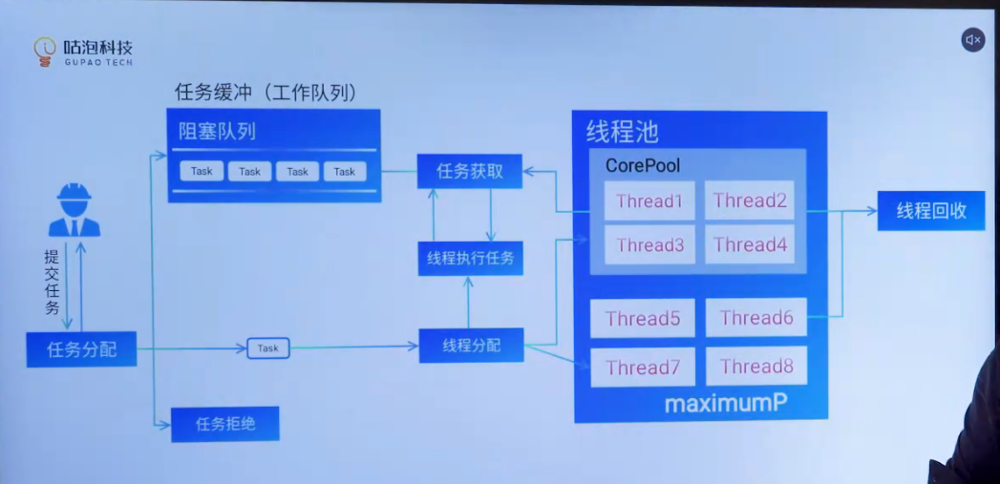

池化技术的目的

- 减少资源频繁创建和销毁带来的额外性能开销
- 使得资源用量可用，资源池中有数量控制，可防止无限制资源创建

哪些资源可以池化

1. 对象创建时间长或者需要大量资源
2. 对象创建之后可以重复使用

例如，线程池、数据库连接池（mysql、redis、mq）、对象池（一些通用常量等）、http连接池

Java 中线程池设计

生产者消费者模式

基于阻塞队列实现工作线程复用

有一个阻塞队列用于存储任务，工作线程负责从队列获取任务然后执行该任务，主线程负责向任务队列提交任务或者可以直接将任务分配到某工作线程，如果工作线程while true 自旋，不断从阻塞队列中获取任务，如果获取到就执行，如果获取不到就阻塞等待任务

拒绝策略，阻塞队列满，如果线程不够用，先增加工作线程数，直到达到最大线程数量，随后拒绝新的任务

