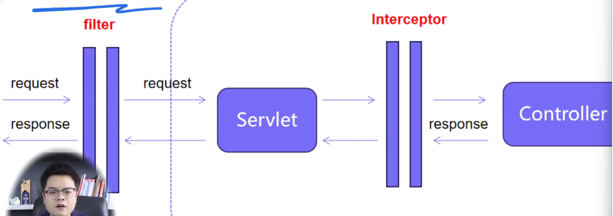

filter 是 servlet 的规范中的组件，用于请求到达servlet之前或者响应离开servlet之后对其进行干预处理。

intercepter 是spring框架提供的一种机制，用于方法执行前后，实现额外的逻辑

区别

1. 实现方式不同，filter 基于函数回调的不同设计， intercepter 基于 java反射机制实现
2. 使用范围不同，filter 依赖于 tomcat 容器，intercepter 依赖于 spring
3. 过滤器可以对所有访问进行增强，intercepter 仅能对 spring mvc 访问增强
4. filter 用于做通用功能，例如通用鉴权，intercepter 用于做一些细粒度的操作，例如 mybatis 插件

