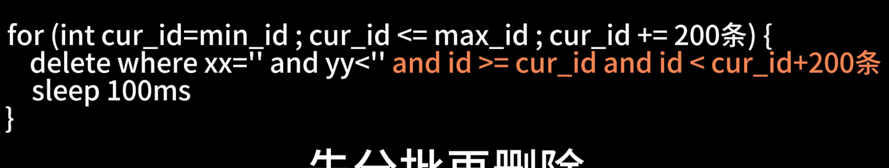

> 个人经验，删除小占比历史数据一般是用pt-archiver，不单能删除，同时还可以备份。另一种方式，如果要删除的数据占比很高，且数据大索引多物理删除慢，可以创建一张影子表和原表结构一致，然后在原表上创建三个触发器（insert、update、delete），通过这些触发器把增量数据写入到影子表中（保证在复制数据的时候，对原表新操作的同步），将原表需要的数据复制到影子表，然后RENAME TABLE，影子表和源表相互转换表名（原子性，会持有短时间的排他锁，阻塞DML）